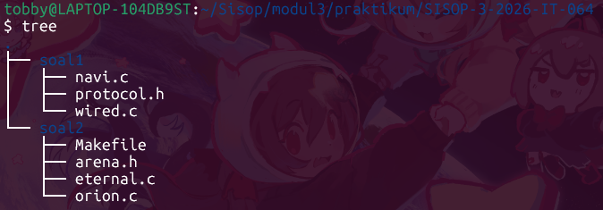

# SISOP-3-2026-IT-064

**Nama:** I Made Tobby Anantha Adiwijaya  
**Prodi:** Teknologi Informasi  
**NRP:** 5027251064  

## Table of Contents
- [Struktur Repository](#struktur-repository)  
- [Soal 1 - Present Day, Present Time](#soal-1---present-day-present-time)
	- [protocol.h](#protocolh)  
	- [wired.c](#wiredc)  
- [Soal 2 - The Battle of Eterion](#soal-2---the-battle-of-eterion)
	- [Makefile](#makefile)  
	- [arena.h](#arenah)

## Struktur Repository
  

## Soal 1 - Present Day, Present Time
Pada soal ini diminta untuk membuat infrastruktur komunikasi digital client-server bernama ``"The Wired"`` menggunakan socket programming pada bahasa C. Tujuannya adalah untuk mendemonstrasikan komunikasi jaringan asinkron multi-klien **tanpa** menggunakan proses `fork()`.  

Beberapa program yang harus dibuat, yakni:
- ``protocol.h``  
File ini berperan sebagai header konfigurasi standar yang dijembatani antara sistem klien dan server agar selaras.  

- ``wired.c``  
Bertindak sebagai SERVER, pusat yang menerima banyak koneksi NAVI, menangani identitas unik, siaran pesan (broadcast), perintah admin jarak jauh (RPC), dan pencatatan permanen.  

- ``navi.c``
Bertindak sebagai CLIENT, aplikasi pengguna yang dapat masuk sebagai entitas biasa atau sebagai The Knights (admin), mengirim dan menerima pesan secara asinkron tanpa proses fork.  

### protocol.h  
Tidak berisi logika, hanya definisi konstanta yang digunakan bersama oleh server dan klien.
```h
#ifndef PROTOCOL_H
#define PROTOCOL_H

#define PORT 8080
#define MAX_CLIENTS 100
#define BUFFER_SIZE 1024

#endif
```
``PORT 8080`` adalah nomor port TCP untuk komunikasi dan ``BUFFER_SIZE`` adalah ukuran maksimum buffer untuk pesan.  

### wired.c

#### Logging Function 
```c
void log_event(const char *role, const char *msg) {
    FILE *f = fopen("history.log", "a");

    time_t t = time(NULL);
    struct tm *tm = localtime(&t);

    fprintf(f, "[%04d-%02d-%02d %02d:%02d:%02d] [%s] %s\n",
	tm->tm_year+1900, tm->tm_mon+1, tm->tm_mday,
	tm->tm_hour, tm->tm_min, tm->tm_sec,
	role, msg);

    fclose(f);
}
```
Fungsi ini bertugas menangani pencatatan sistem operasional (system logging) ke ``history.log`` dengan menggunakan struktur waktu ``<time.h>`` untuk mengambil ``localtime()`` guna merekam jam eksekusi sistem. Sistem membuka file log menggunakan mode append ``"a"`` agar penulisan log baru ditambahkan di akhir file tanpa menimpa histori log sebelumnya.  
Format:
```
[YYYY-MM-DD HH:MM:SS] [System/Admin/User] [Status/Command/Chat]
```

#### User Chats Logging Function
```c
void log_chat(const char *user, const char *msg) {
    FILE *f = fopen("history.log", "a");

    time_t t = time(NULL);
    struct tm *tm = localtime(&t);

	char clean_msg[BUFFER_SIZE];
    strncpy(clean_msg, msg, sizeof(clean_msg)-1);
    clean_msg[sizeof(clean_msg)-1] = '\0';
    clean_msg[strcspn(clean_msg, "\n")] = '\0';

    fprintf(f, "[%04d-%02d-%02d %02d:%02d:%02d] [User] [[%s]: %s]\n",
	tm->tm_year+1900, tm->tm_mon+1, tm->tm_mday,
	tm->tm_hour, tm->tm_min, tm->tm_sec,
	user, clean_msg);

    fclose(f);
}
```
Fungsi ini mencatat pesan obrolan pengguna ke ``history.log``. Dibanding sebelumnya, fungsi ini dilengkapi dengan proteksi memori menggunakan ``strncpy`` untuk membatasi panjang string maksimal, serta pembersihan karakter newline (``\n``) melalui ``strcspn()``. Manipulasi memori ini wajib dilakukan agar output pada file log tetap sejajar secara linier dan terstruktur rapi.  
Format:
```
[YYYY-MM-DD HH:MM:SS] [User] [[nama]: pesan]
```

#### Duplicate Name Function
```c
int is_name_exist(const char *name) {
    for(int i = 0; i < client_count; i++) {
		if(strcmp(clients[i].name, name) == 0) {
	    	return 1;
		}
    }
    return 0;
}
```
Fungsi ini melakukan perulangan pada array ``clients`` aktif dan menggunakan komparasi ``strcmp()`` untuk membandingkan ``clients[i].name`` dengan parameter ``name``. Fungsi mengembalikan nilai 1 apabila ada identitas yang sama dan nilai 0 jika belum ada.

#### Remove Client Function
```c
void remove_client(int index) {
    char logbuf[128];
    sprintf(logbuf, "[User '%s' disconnected]", clients[index].name);
    log_event("System", logbuf);

    close(clients[index].sock);

    for(int i = index; i < client_count - 1; i++) {
		clients[i] = clients[i+1];
    }
    client_count--;
}
```
Fungsi untuk menghapus klien dari daftar saat putus koneksi atau perintah keluar. Sistem akan mencatat log pemutusan kemudian melakukan penutupan socket klien melalui ``close()``, setelah itu akan sistem menghapus entri dari array dengan menggeser elemen setelahnya ke kiri, lalu mengurangi ``client_count`` agar susunan memori tertata ulang.

#### Broadcast Function
```c
void broadcast(const char *msg, int sender_sock) {
    for(int i = 0; i < client_count; i++) {
		if(clients[i].sock != sender_sock && clients[i].is_admin == 0) {
	    	send(clients[i].sock, msg, strlen(msg), 0);
		}
    }
}
```
Fungsi ini berfungsi untuk mengirim pesan ke semua klien biasa (non-admin) kecuali pengirim itu sendiri. Di sini sistem akan memeriksa ``clients[i].is_admin == 0`` dan ``sock != sender_sock``. Sehingga Admin tidak menerima siaran percakapan dan perintah admin akan ditangani terpisah.  

#### Main Function
- Deklarasi Variabel dan Inisialisasi Jaringan
```c
int main() {
	int server_fd, new_sock;
    struct sockaddr_in address;
    int addrlen = sizeof(address);

    fd_set readfds;

    server_fd = socket(AF_INET, SOCK_STREAM, 0);

    address.sin_family = AF_INET;
    address.sin_addr.s_addr = INADDR_ANY;
    address.sin_port = htons(PORT);

    bind(server_fd, (struct sockaddr*)&address, sizeof(address));
    listen(server_fd, 10);
```
Bagian awal fungsi untuk menyiapkan seluruh variabel yang diperlukan serta membangun fondasi komunikasi jaringan. Di mana ``server_fd`` dan ``new_sock`` dideklarasikan untuk menampung deskriptor socket server dan setiap koneksi baru. Struktur ``sockaddr_in address`` diisi dengan ``AF_INET`` dan ``INADDR_ANY`` agar server menerima koneksi dari seluruh antarmuka yang tersedia, serta ``port 8080`` yang dikonversi ke network byte order melalui ``htons(PORT)``. Variabel ``fd_set readfds`` akan digunakan oleh ``select()`` dalam memantau aktivitas pada banyak socket secara bersamaan. Setelah socket berhasil dibuat dengan ``socket(AF_INET, SOCK_STREAM, 0)``, panggilan ``bind()`` melekatkan server descriptor pada alamat dan port yang telah ditentukan. Panggilan ``listen(server_fd, 10)`` kemudian mengaktifkan antrean koneksi masuk dengan panjang maksimal 10, sehingga server siap untuk menerima klien.  

- Pencatatan Waktu Server
```c
log_event("System", "[SERVER ONLINE]");
printf("Server running on port %d...\n", PORT);

server_start_time = time(NULL);
```
Di sini akan dicatat peristiwa server hidup ke ``history.log`` dengan fungsi ``log_event``. Kemudian mulai menyimpan waktu mulai server di variabel global ``server_start_time``, yang nantinya digunakan untuk menghitung uptime saat admin meminta ``RPC_GET_UPTIME``.

- Loop Utama
```c
while(1) {
	FD_ZERO(&readfds);
	FD_SET(server_fd, &readfds);
	int max_fd = server_fd;

	for(int i = 0; i < client_count; i++) {
		FD_SET(clients[i].sock, &readfds);
		if(clients[i].sock > max_fd) {
			max_fd = clients[i].sock;
		}
	}

	select(max_fd + 1, &readfds, NULL, NULL, NULL);
```
Inti server ini berada dalam loop ``while(1)`` yang memanfaatkan ``select()`` untuk menangani banyak deskriptor secara asinkron tanpa proses turunan. Di sini ``FD_ZERO`` mengosongkan himpunan ``readfds``. Lalu ``FD_SET(server_fd, &readfds)`` menambahkan socket server agar terpantau jika ada permintaan koneksi baru. Kemudian perulangan For menambahkan setiap socket klien aktif ke himpunan. Di mana variabel ``max_fd`` kemudian akan menentukan nilai deskriptor file tertinggi dan ``select(max_fd+1, ...)`` akan memblok hingga ada aktivitas pada salah satu socket. Setelah ``select()`` kembali, ``readfds`` akan berisi deskriptor yang siap dibaca.

- New Client
```c
if(FD_ISSET(server_fd, &readfds)) {
new_sock = accept(server_fd, (struct sockaddr*)&address, (socklen_t*)&addrlen);

char name[50];
memset(name, 0, sizeof(name));
recv(new_sock, name, sizeof(name), 0);

name[strcspn(name, "\n")] = 0;	// remove newline
```
Selanjutnya apabila ``server_fd`` ada dalam kondisi siap baca, maka akan ada klien baru yang mencoba terhubung. Di mana fungsi ``accept()`` akan menerima koneksi, mengembalikan socket baru ``new_sock`` untuk komunikasi dengan klien tersebut. Kemudian pengguna akan mengisi nama yang mereka ingin pakai di The Wired sehingga server akan membaca data pertama yang dikirim klien, yaitu ``nama pengguna``. Tidak lupa juga karakter newline (``\n``) dihapus agar string bersih.

- New Client: Admin
```c
if(strcmp(name, "The Knights") == 0) {
	char password[50];

	send(new_sock, "Enter Password: ", 16, 0);
	recv(new_sock, password, sizeof(password), 0);
	password[strcspn(password, "\n")] = 0;

	// Password Check
	if(strcmp(password, "protocol7") != 0) {
		send(new_sock, "[System] Authentication Failed.\n", 32, 0);
		close(new_sock);
		continue;
	}

	clients[client_count].sock = new_sock;
	strcpy(clients[client_count].name, name);
	clients[client_count].is_admin = 1;
	client_count++;

	char logbuf[128];
	sprintf(logbuf, "[User '%s' connected]", name);
	log_event("System", logbuf);

	send(new_sock, "[System] Authentication Successful. Granted Admin Privileges.\n\n", 67, 0);

	continue;
}
```
Jika hasil input nama adalah “The Knights”, server akan memulai alur autentikasi admin. Sebuah pesan ``"Enter Password: "`` dikirim ke klien, dan server menunggu balasan password. Setelah diterima dan dibersihkan dari newline, password dibandingkan dengan string ``"protocol7"``. Apabila tidak cocok, server mengirimkan pesan ``"[System] Authentication Failed."`` dan menutup socket klien. Sebaliknya, apabila password benar, admin dicatat ke dalam array ``clients`` dengan flag ``is_admin = 1``. Server kemudian menulis log ``"[User 'The Knights' connected]"``, mengirim konfirmasi sukses ke klien beserta daftar perintah yang dapat dijalankan.

- New Client: User
```c
if(is_name_exist(name)) {
	char msg[128];
	sprintf(msg, "[System] The identity '%s' is already synchronized in The Wired.\n", name);
	send(new_sock, msg, strlen(msg), 0);
	close(new_sock);
} else {
	clients[client_count].sock = new_sock;
	strcpy(clients[client_count].name, name);
	clients[client_count].is_admin = 0;
	client_count++;

	char logbuf[128];
	sprintf(logbuf, "[User '%s' connected]", name);
	log_event("System", logbuf);

	char welcome[128];
	sprintf(welcome, "--- Welcome to The Wired, %s ---\n", name);
	send(new_sock, welcome, strlen(welcome), 0);
}
```
Bagian ini adalah klien baru selain Admin. Di sini server juga mengecek keunikan identitas melalui fungsi ``is_name_exist(name)``. Jika nama sudah ada, server mengirim pesan ``"[System] The identity '<nama>' is already synchronized in The Wired."``, mengirimkan penolakan ke klien, dan langsung menutup koneksi. Pengguna tidak jadi terdaftar. Sebaliknya, jika nama belum dipakai, klien diterima sebagai pengguna biasa. Ia kemudian ditambahkan ke array ``clients`` dengan flag ``is_admin = 0``. Server kemudian mencatat log koneksi dan mengirimkan ucapan selamat datang ``"--- Welcome to The Wired, <nama> ---\n"``. Dengan demikian, setiap entitas yang terhubung memiliki identitas unik yang diverifikasi di awal.

- Handle Client: Admin
```c
if(clients[i].is_admin == 1) {
	char buffer[BUFFER_SIZE];
	int len = recv(clients[i].sock, buffer, sizeof(buffer), 0);
	if(len <= 0) {
		remove_client(i);
		i--;
		continue;
	}
	buffer[len] = '\0';

	...
	...

	continue;
}
```
Penanganan klien untuk admin apabila ``recv()`` mengembalikan nilai ≤ 0, klien dianggap terputus dan langsung dihapus melalui ``remove_client(i)`` dan indeks loop dikurangi (``i--``) agar iterasi tetap konsisten. Di sini Admin memiliki beberapa perintah spesial yang bisa dijalankan, yakni:  

a) ``RPC_GET_USERS``
```c
// Option 1
if(strncmp(buffer, "1", 1) == 0) {
	log_event("Admin", "[RPC_GET_USERS]");

	int count = 0;

	for(int j = 0; j < client_count; j++) {
		if(clients[j].is_admin == 0) {
			count++;
		}
	}

	char msg[100];
	sprintf(msg, "[Admin] Active Users: %d\n", count);
	send(clients[i].sock, msg, strlen(msg), 0);
```
Menghitung jumlah klien biasa (non-admin) dan mengirimkannya kembali ke admin.  

b) ``RPC_GET_UPTIME``
```c
// Option 2
} else if(strncmp(buffer, "2", 1) == 0) {
	log_event("Admin", "[RPC_GET_UPTIME]");

	time_t now = time(NULL);
	int uptime = (int)(now - server_start_time);

	char msg[100];
	sprintf(msg, "[Admin] Uptime: %d seconds\n", uptime);
	send(clients[i].sock, msg, strlen(msg), 0);
```
Menghitung selisih waktu saat ini dengan server_start_time, mengirimkannya.  

c) ``RPC_SHUTDOWN``
```c
// Option 3
} else if(strncmp(buffer, "3", 1) == 0) {
	log_event("Admin", "[RPC_SHUTDOWN]");

	char *msg = "[System] EMERGENCY SHUTDOWN INITIATED\n";
	broadcast(msg, -1);

	exit(0);
```
Menyiarkan pesan darurat ke semua klien biasa, mencatat log, lalu secara darurat menghentikan server dengan ``exit(0)``.  

d) ``Disconnect`` Admin
```c
// Option 4
} else if(strncmp(buffer, "4", 1) == 0) {
	remove_client(i);
	i--;
```
Menghapus admin dari daftar dan memutuskan hubungan.  

e) Apabila Selain Opsi 1-4
```c
// Wrong Option
} else {
	char *msg = "[Admin] Invalid command. Please choose 1-4.\n";
	send(clients[i].sock, msg, strlen(msg), 0);
}
```
Memberi tahu admin bahwa perintah tidak dikenali.

- Handle Client: User
```c
char buffer[BUFFER_SIZE];
int len = recv(clients[i].sock, buffer, sizeof(buffer), 0);

if(len <= 0) {
	remove_client(i);
	i--;
} else {
	buffer[len] = '\0';

	if(strcmp(buffer, "/exit\n") == 0) {
		remove_client(i);
		i--;
		continue;
	}

	char msg[1200];
	sprintf(msg, "[%s]: %s", clients[i].name, buffer);

	broadcast(msg, clients[i].sock);
	log_chat(clients[i].name, buffer);
}
```
Penanganan klien untuk pengguna biasa. Apabila user mengirim pesan ``/exit``, maka ia akan disconnect dan dihapus dari daftar dan dilakukan log pemutusan ke ``history.log``. Apabila user mengirimkan pesan biasa, maka akan terkirim seperti biasa dengan broadcast ke semua klien biasa kecuali pengirim dan admin. Selain itu, juga dilakukan penulisan log ke ``history.log`` dengan format ``[User] [[nama]: pesan]``.

### navi.c

## Soal 2 - The Battle of Eterion
Pada soal ini diminta untuk membangun sebuah sistem permainan battle arena multiplayer berbasis terminal yang disebut Eterion. Sistem ini terdiri dari dua program terpisah yang saling berkomunikasi menggunakan mekanisme Inter-Process Communication (IPC) milik Linux, yaitu Shared Memory, Message Queue, dan Semaphore.

Beberapa program yang harus dibuat, yakni:  
- ``Makefile``  
File berguna untuk membantu saat proses debugging (opsional).  

- ``orion.c``  
Bertindak sebagai SERVER, mengelola seluruh state permainan, data pemain, antrian matchmaking, dan logika battle.  

- ``eternal.c``  
Bertindak sebagai CLIENT, menyediakan antarmuka terminal untuk pemain agar bisa register, login, masuk battle, membeli senjata, dan melihat riwayat.  

- ``arena.h``  
File header bersama yang mendefinisikan semua struct, konstanta, IPC keys, dan fungsi inline yang digunakan oleh program ``orion.c`` dan ``eternal.c``.

### Makefile
File ini dipergunakan untuk membantu dalam proses debugging. Setiap ingin run kedua program tersebut, gunakan ``make`` pada terminal untuk compile. Setiap menghentikan program, gunakan ``make clear_ipc`` untuk menghapus sisa shared memory.
```make
CC = gcc
CFLAGS = -Wall -pthread
LDFLAGS = -lrt

all: server client

server: orion.c arena.h
	$(CC) $(CFLAGS) orion.c -o orion $(LDFLAGS)

client: eternal.c arena.h
	$(CC) $(CFLAGS) eternal.c -o eternal $(LDFLAGS)

clean:
	rm -f orion eternal

clear_ipc:
	ipcs -m | grep 0x00001234 | awk '{print $$2}' | xargs -r ipcrm -m
	ipcs -q | grep 0x0000ABCD | awk '{print $$2}' | xargs -r ipcrm -q
	ipcs -s | grep 0x0000EF01 | awk '{print $$2}' | xargs -r ipcrm -s
	ipcs -s | grep 0x0000EF02 | awk '{print $$2}' | xargs -r ipcrm -s
	ipcs -s | grep 0x0000EF03 | awk '{print $$2}' | xargs -r ipcrm -s
	ipcs -m | grep 0x00005678 | awk '{print $$2}' | xargs -r ipcrm -m
	ipcs -m | grep 0x00009012 | awk '{print $$2}' | xargs -r ipcrm -m
```

### arena.h
Ini merupakan file header yang di-include oleh kedua program. File ini tidak berisi logika, melainkan hanya definisi bersama agar kedua program memiliki pemahaman yang sama terhadap struktur data dan protokol komunikasi.
#### IPC Keys
```h
// === IPC Keys ===
#define SHM_KEY_PLAYERS 0x00001234    // Shared memory: player data
#define SHM_KEY_BATTLES 0x00005678    // Shared memory: active battles
#define SHM_KEY_QUEUE 0x00009012    // Shared memory: matchmaking queue

#define MSG_KEY_MAIN 0x0000ABCD    // Message queue: client <to> server
#define SEM_KEY_PLAYERS 0x0000EF01    // Semaphore: player data
#define SEM_KEY_BATTLES 0x0000EF02    // Semaphore: battle data
#define SEM_KEY_QUEUE 0x0000EF03    // Semaphore: matchmaking queue
```
IPC yang berfungsi untuk menyimpan Shared Memory untuk setiap konstanta yang dideklarasikan.

#### 