# SISOP-3-2026-IT-064

**Nama:** I Made Tobby Anantha Adiwijaya  
**Prodi:** Teknologi Informasi  
**NRP:** 5027251064  

## Table of Contents
- [Struktur Repository](#struktur-repository)  
- [Soal 1 - Present Day, Present Time](#soal-1---present-day-present-time)
	- [protocol.h](#protocolh)  
	- [wired.c](#wiredc)  
	- [navi.c](#navic)  
	- [Uji Coba](#uji-coba)  
- [Soal 2 - The Battle of Eterion](#soal-2---the-battle-of-eterion)
	- [Makefile](#makefile)  
	- [arena.h](#arenah)
	- [orion.c](#orionc)
	- [eternal.c](#eternalc)
	- [Uji Coba](#uji-coba-1)

## Struktur Repository
  

## Soal 1 - Present Day, Present Time
Pada soal ini diminta untuk membuat infrastruktur komunikasi digital client-server bernama ``"The Wired"`` menggunakan socket programming pada bahasa C. Tujuannya adalah untuk mendemonstrasikan komunikasi jaringan asinkron multi-klien **tanpa** menggunakan proses `fork()`.  

Beberapa program yang harus dibuat, yakni:
- ``protocol.h``  
File ini berperan sebagai header konfigurasi standar yang dijembatani antara sistem klien dan server agar selaras.  

- ``wired.c``  
Bertindak sebagai SERVER, pusat yang menerima banyak koneksi NAVI, menangani identitas unik, siaran pesan (broadcast), perintah admin jarak jauh (RPC), dan pencatatan permanen.  

- ``navi.c``
Bertindak sebagai CLIENT, aplikasi pengguna yang dapat masuk sebagai entitas biasa atau sebagai The Knights (admin), mengirim dan menerima pesan secara asinkron tanpa proses fork.  

### protocol.h  
Tidak berisi logika, hanya definisi konstanta yang digunakan bersama oleh server dan klien.
```h
#ifndef PROTOCOL_H
#define PROTOCOL_H

#define PORT 8080
#define MAX_CLIENTS 100
#define BUFFER_SIZE 1024

#endif
```
``PORT 8080`` adalah nomor port TCP untuk komunikasi dan ``BUFFER_SIZE`` adalah ukuran maksimum buffer untuk pesan.  

### wired.c
File yang bertindak sebagai Server.

#### Logging Function 
```c
void log_event(const char *role, const char *msg) {
    FILE *f = fopen("history.log", "a");

    time_t t = time(NULL);
    struct tm *tm = localtime(&t);

    fprintf(f, "[%04d-%02d-%02d %02d:%02d:%02d] [%s] %s\n",
	tm->tm_year+1900, tm->tm_mon+1, tm->tm_mday,
	tm->tm_hour, tm->tm_min, tm->tm_sec,
	role, msg);

    fclose(f);
}
```
Fungsi ini bertugas menangani pencatatan sistem operasional (system logging) ke ``history.log`` dengan menggunakan struktur waktu ``<time.h>`` untuk mengambil ``localtime()`` guna merekam jam eksekusi sistem. Sistem membuka file log menggunakan mode append ``"a"`` agar penulisan log baru ditambahkan di akhir file tanpa menimpa histori log sebelumnya.  
Format:
```
[YYYY-MM-DD HH:MM:SS] [System/Admin/User] [Status/Command/Chat]
```

#### User Chats Logging Function
```c
void log_chat(const char *user, const char *msg) {
    FILE *f = fopen("history.log", "a");

    time_t t = time(NULL);
    struct tm *tm = localtime(&t);

	char clean_msg[BUFFER_SIZE];
    strncpy(clean_msg, msg, sizeof(clean_msg)-1);
    clean_msg[sizeof(clean_msg)-1] = '\0';
    clean_msg[strcspn(clean_msg, "\n")] = '\0';

    fprintf(f, "[%04d-%02d-%02d %02d:%02d:%02d] [User] [[%s]: %s]\n",
	tm->tm_year+1900, tm->tm_mon+1, tm->tm_mday,
	tm->tm_hour, tm->tm_min, tm->tm_sec,
	user, clean_msg);

    fclose(f);
}
```
Fungsi ini mencatat pesan obrolan pengguna ke ``history.log``. Dibanding sebelumnya, fungsi ini dilengkapi dengan proteksi memori menggunakan ``strncpy`` untuk membatasi panjang string maksimal, serta pembersihan karakter newline (``\n``) melalui ``strcspn()``. Manipulasi memori ini wajib dilakukan agar output pada file log tetap sejajar secara linier dan terstruktur rapi.  
Format:
```
[YYYY-MM-DD HH:MM:SS] [User] [[nama]: pesan]
```

#### Duplicate Name Function
```c
int is_name_exist(const char *name) {
    for(int i = 0; i < client_count; i++) {
		if(strcmp(clients[i].name, name) == 0) {
	    	return 1;
		}
    }
    return 0;
}
```
Fungsi ini melakukan perulangan pada array ``clients`` aktif dan menggunakan komparasi ``strcmp()`` untuk membandingkan ``clients[i].name`` dengan parameter ``name``. Fungsi mengembalikan nilai 1 apabila ada identitas yang sama dan nilai 0 jika belum ada.

#### Remove Client Function
```c
void remove_client(int index) {
    char logbuf[128];
    sprintf(logbuf, "[User '%s' disconnected]", clients[index].name);
    log_event("System", logbuf);

    close(clients[index].sock);

    for(int i = index; i < client_count - 1; i++) {
		clients[i] = clients[i+1];
    }
    client_count--;
}
```
Fungsi untuk menghapus klien dari daftar saat putus koneksi atau perintah keluar. Sistem akan mencatat log pemutusan kemudian melakukan penutupan socket klien melalui ``close()``, setelah itu akan sistem menghapus entri dari array dengan menggeser elemen setelahnya ke kiri, lalu mengurangi ``client_count`` agar susunan memori tertata ulang.

#### Broadcast Function
```c
void broadcast(const char *msg, int sender_sock) {
    for(int i = 0; i < client_count; i++) {
		if(clients[i].sock != sender_sock && clients[i].is_admin == 0) {
	    	send(clients[i].sock, msg, strlen(msg), 0);
		}
    }
}
```
Fungsi ini berfungsi untuk mengirim pesan ke semua klien biasa (non-admin) kecuali pengirim itu sendiri. Di sini sistem akan memeriksa ``clients[i].is_admin == 0`` dan ``sock != sender_sock``. Sehingga Admin tidak menerima siaran percakapan dan perintah admin akan ditangani terpisah.  

#### Main Function
- Deklarasi Variabel dan Inisialisasi Jaringan
```c
int main() {
	int server_fd, new_sock;
    struct sockaddr_in address;
    int addrlen = sizeof(address);

    fd_set readfds;

    server_fd = socket(AF_INET, SOCK_STREAM, 0);

    address.sin_family = AF_INET;
    address.sin_addr.s_addr = INADDR_ANY;
    address.sin_port = htons(PORT);

    bind(server_fd, (struct sockaddr*)&address, sizeof(address));
    listen(server_fd, 10);
```
Bagian awal fungsi untuk menyiapkan seluruh variabel yang diperlukan serta membangun fondasi komunikasi jaringan. Di mana ``server_fd`` dan ``new_sock`` dideklarasikan untuk menampung deskriptor socket server dan setiap koneksi baru. Struktur ``sockaddr_in address`` diisi dengan ``AF_INET`` dan ``INADDR_ANY`` agar server menerima koneksi dari seluruh antarmuka yang tersedia, serta ``port 8080`` yang dikonversi ke network byte order melalui ``htons(PORT)``. Variabel ``fd_set readfds`` akan digunakan oleh ``select()`` dalam memantau aktivitas pada banyak socket secara bersamaan. Setelah socket berhasil dibuat dengan ``socket(AF_INET, SOCK_STREAM, 0)``, panggilan ``bind()`` melekatkan server descriptor pada alamat dan port yang telah ditentukan. Panggilan ``listen(server_fd, 10)`` kemudian mengaktifkan antrean koneksi masuk dengan panjang maksimal 10, sehingga server siap untuk menerima klien.  

- Pencatatan Waktu Server
```c
log_event("System", "[SERVER ONLINE]");
printf("Server running on port %d...\n", PORT);

server_start_time = time(NULL);
```
Di sini akan dicatat peristiwa server hidup ke ``history.log`` dengan fungsi ``log_event``. Kemudian mulai menyimpan waktu mulai server di variabel global ``server_start_time``, yang nantinya digunakan untuk menghitung uptime saat admin meminta ``RPC_GET_UPTIME``.

- Loop Utama
```c
while(1) {
	FD_ZERO(&readfds);
	FD_SET(server_fd, &readfds);
	int max_fd = server_fd;

	for(int i = 0; i < client_count; i++) {
		FD_SET(clients[i].sock, &readfds);
		if(clients[i].sock > max_fd) {
			max_fd = clients[i].sock;
		}
	}

	select(max_fd + 1, &readfds, NULL, NULL, NULL);
```
Inti server ini berada dalam loop ``while(1)`` yang memanfaatkan ``select()`` untuk menangani banyak deskriptor secara asinkron tanpa proses turunan. Di sini ``FD_ZERO`` mengosongkan himpunan ``readfds``. Lalu ``FD_SET(server_fd, &readfds)`` menambahkan socket server agar terpantau jika ada permintaan koneksi baru. Kemudian perulangan For menambahkan setiap socket klien aktif ke himpunan. Di mana variabel ``max_fd`` kemudian akan menentukan nilai deskriptor file tertinggi dan ``select(max_fd+1, ...)`` akan memblok hingga ada aktivitas pada salah satu socket. Setelah ``select()`` kembali, ``readfds`` akan berisi deskriptor yang siap dibaca.

- New Client
```c
if(FD_ISSET(server_fd, &readfds)) {
new_sock = accept(server_fd, (struct sockaddr*)&address, (socklen_t*)&addrlen);

char name[50];
memset(name, 0, sizeof(name));
recv(new_sock, name, sizeof(name), 0);

name[strcspn(name, "\n")] = 0;	// remove newline
```
Selanjutnya apabila ``server_fd`` ada dalam kondisi siap baca, maka akan ada klien baru yang mencoba terhubung. Di mana fungsi ``accept()`` akan menerima koneksi, mengembalikan socket baru ``new_sock`` untuk komunikasi dengan klien tersebut. Kemudian pengguna akan mengisi nama yang mereka ingin pakai di The Wired sehingga server akan membaca data pertama yang dikirim klien, yaitu ``nama pengguna``. Tidak lupa juga karakter newline (``\n``) dihapus agar string bersih.

- New Client: Admin
```c
if(strcmp(name, "The Knights") == 0) {
	char password[50];

	send(new_sock, "Enter Password: ", 16, 0);
	recv(new_sock, password, sizeof(password), 0);
	password[strcspn(password, "\n")] = 0;

	// Password Check
	if(strcmp(password, "protocol7") != 0) {
		send(new_sock, "[System] Authentication Failed.\n", 32, 0);
		close(new_sock);
		continue;
	}

	clients[client_count].sock = new_sock;
	strcpy(clients[client_count].name, name);
	clients[client_count].is_admin = 1;
	client_count++;

	char logbuf[128];
	sprintf(logbuf, "[User '%s' connected]", name);
	log_event("System", logbuf);

	send(new_sock, "[System] Authentication Successful. Granted Admin Privileges.\n\n", 67, 0);

	continue;
}
```
Jika hasil input nama adalah “The Knights”, server akan memulai alur autentikasi admin. Sebuah pesan ``"Enter Password: "`` dikirim ke klien, dan server menunggu balasan password. Setelah diterima dan dibersihkan dari newline, password dibandingkan dengan string ``"protocol7"``. Apabila tidak cocok, server mengirimkan pesan ``"[System] Authentication Failed."`` dan menutup socket klien. Sebaliknya, apabila password benar, admin dicatat ke dalam array ``clients`` dengan flag ``is_admin = 1``. Server kemudian menulis log ``"[User 'The Knights' connected]"``, mengirim konfirmasi sukses ke klien beserta daftar perintah yang dapat dijalankan.

- New Client: User
```c
if(is_name_exist(name)) {
	char msg[128];
	sprintf(msg, "[System] The identity '%s' is already synchronized in The Wired.\n", name);
	send(new_sock, msg, strlen(msg), 0);
	close(new_sock);
} else {
	clients[client_count].sock = new_sock;
	strcpy(clients[client_count].name, name);
	clients[client_count].is_admin = 0;
	client_count++;

	char logbuf[128];
	sprintf(logbuf, "[User '%s' connected]", name);
	log_event("System", logbuf);

	char welcome[128];
	sprintf(welcome, "--- Welcome to The Wired, %s ---\n", name);
	send(new_sock, welcome, strlen(welcome), 0);
}
```
Bagian ini adalah klien baru selain Admin. Di sini server juga mengecek keunikan identitas melalui fungsi ``is_name_exist(name)``. Jika nama sudah ada, server mengirim pesan ``"[System] The identity '<nama>' is already synchronized in The Wired."``, mengirimkan penolakan ke klien, dan langsung menutup koneksi. Pengguna tidak jadi terdaftar. Sebaliknya, jika nama belum dipakai, klien diterima sebagai pengguna biasa. Ia kemudian ditambahkan ke array ``clients`` dengan flag ``is_admin = 0``. Server kemudian mencatat log koneksi dan mengirimkan ucapan selamat datang ``"--- Welcome to The Wired, <nama> ---\n"``. Dengan demikian, setiap entitas yang terhubung memiliki identitas unik yang diverifikasi di awal.

- Handle Client: Admin
```c
if(clients[i].is_admin == 1) {
	char buffer[BUFFER_SIZE];
	int len = recv(clients[i].sock, buffer, sizeof(buffer), 0);
	if(len <= 0) {
		remove_client(i);
		i--;
		continue;
	}
	buffer[len] = '\0';

	...
	...

	continue;
}
```
Penanganan klien untuk admin apabila ``recv()`` mengembalikan nilai ≤ 0, klien dianggap terputus dan langsung dihapus melalui ``remove_client(i)`` dan indeks loop dikurangi (``i--``) agar iterasi tetap konsisten. Di sini Admin memiliki beberapa perintah spesial yang bisa dijalankan, yakni:  

a) ``RPC_GET_USERS``
```c
// Option 1
if(strncmp(buffer, "1", 1) == 0) {
	log_event("Admin", "[RPC_GET_USERS]");

	int count = 0;

	for(int j = 0; j < client_count; j++) {
		if(clients[j].is_admin == 0) {
			count++;
		}
	}

	char msg[100];
	sprintf(msg, "[Admin] Active Users: %d\n", count);
	send(clients[i].sock, msg, strlen(msg), 0);
```
Menghitung jumlah klien biasa (non-admin) dan mengirimkannya kembali ke admin.  

b) ``RPC_GET_UPTIME``
```c
// Option 2
} else if(strncmp(buffer, "2", 1) == 0) {
	log_event("Admin", "[RPC_GET_UPTIME]");

	time_t now = time(NULL);
	int uptime = (int)(now - server_start_time);

	char msg[100];
	sprintf(msg, "[Admin] Uptime: %d seconds\n", uptime);
	send(clients[i].sock, msg, strlen(msg), 0);
```
Menghitung selisih waktu saat ini dengan server_start_time, mengirimkannya.  

c) ``RPC_SHUTDOWN``
```c
// Option 3
} else if(strncmp(buffer, "3", 1) == 0) {
	log_event("Admin", "[RPC_SHUTDOWN]");

	char *msg = "[System] EMERGENCY SHUTDOWN INITIATED\n";
	broadcast(msg, -1);

	exit(0);
```
Menyiarkan pesan darurat ke semua klien biasa, mencatat log, lalu secara darurat menghentikan server dengan ``exit(0)``.  

d) ``Disconnect`` Admin
```c
// Option 4
} else if(strncmp(buffer, "4", 1) == 0) {
	remove_client(i);
	i--;
```
Menghapus admin dari daftar dan memutuskan hubungan.  

e) Apabila Selain Opsi 1-4
```c
// Wrong Option
} else {
	char *msg = "[Admin] Invalid command. Please choose 1-4.\n";
	send(clients[i].sock, msg, strlen(msg), 0);
}
```
Memberi tahu admin bahwa perintah tidak dikenali.

- Handle Client: User
```c
char buffer[BUFFER_SIZE];
int len = recv(clients[i].sock, buffer, sizeof(buffer), 0);

if(len <= 0) {
	remove_client(i);
	i--;
} else {
	buffer[len] = '\0';

	if(strcmp(buffer, "/exit\n") == 0) {
		remove_client(i);
		i--;
		continue;
	}

	char msg[1200];
	sprintf(msg, "[%s]: %s", clients[i].name, buffer);

	broadcast(msg, clients[i].sock);
	log_chat(clients[i].name, buffer);
}
```
Penanganan klien untuk pengguna biasa. Apabila user mengirim pesan ``/exit``, maka ia akan disconnect dan dihapus dari daftar dan dilakukan log pemutusan ke ``history.log``. Apabila user mengirimkan pesan biasa, maka akan terkirim seperti biasa dengan broadcast ke semua klien biasa kecuali pengirim dan admin. Selain itu, juga dilakukan penulisan log ke ``history.log`` dengan format ``[User] [[nama]: pesan]``.

### navi.c
File yang bertindak sebagai Client.

#### Deklarasi Variabel dan Koneksi ke Server
```c
int main() {
    int sock;
    struct sockaddr_in serv_addr;
    fd_set fds;

    sock = socket(AF_INET, SOCK_STREAM, 0);

    serv_addr.sin_family = AF_INET;
    serv_addr.sin_port = htons(PORT);
    inet_pton(AF_INET, "127.0.0.1", &serv_addr.sin_addr);

    connect(sock, (struct sockaddr*)&serv_addr, sizeof(serv_addr));

    char name[50];
	char buffer[BUFFER_SIZE];
	int len;
	int is_admin = 0;
```
Fungsi utama klien dimulai dengan menyiapkan variabel inti dan membangun koneksi ke server. Variabel ``sock`` dibuat untuk menampung deskriptor socket klien, sementara ``serv_addr`` diisi dengan keluarga alamat ``AF_INET``, port ``8080`` yang dikonversi menggunakan ``htons(PORT)``, dan alamat IP server ``127.0.0.1`` melalui ``inet_pton()``. Panggilan ``socket(AF_INET, SOCK_STREAM, 0)`` menghasilkan socket TCP, dan koneksi ke server dijalin dengan ``connect()``. Setelah koneksi berhasil, tiga variabel penting disiapkan, yakni ``name`` untuk menyimpan nama pengguna, ``buffer`` untuk menerima data dari server, serta ``len`` untuk panjang data yang diterima. Flag ``is_admin`` mula‑mula diinisialisasi ke ``0`` sebagai penanda bahwa klien belum memiliki hak istimewa admin.

#### Fase Login
```c
while(1) {
	printf("Enter your name: ");
	fflush(stdout);

	fgets(name, sizeof(name), stdin);
	name[strcspn(name, "\n")] = 0;

	send(sock, name, strlen(name), 0);

	len = recv(sock, buffer, sizeof(buffer)-1, 0);
	if(len <= 0) {
		printf("Connection closed.\n");
		return 0;
	}

	buffer[len] = '\0';
	printf("%s", buffer);
	fflush(stdout);

	// Duplicate Name
	if(strstr(buffer, "already synchronized")) {
		close(sock);
		return 0;
	}

	// Handle Password Admin
	if(strstr(buffer, "Enter Password")) {
		char pass[50];

		fgets(pass, sizeof(pass), stdin);
		send(sock, pass, strlen(pass), 0);

		len = recv(sock, buffer, sizeof(buffer)-1, 0);
		if(len <= 0) {
			printf("Connection closed.\n");
			return 0;
		}

		buffer[len] = '\0';
		printf("%s", buffer);
		fflush(stdout);

		if(strstr(buffer, "Authentication Failed")) {
			close(sock);
			return 0;
		}

		// If Admin
		if(strstr(buffer, "Authentication Successful")) {
			is_admin = 1;

			printf("=== THE KNIGHTS CONSOLE ===\n");
			printf("1. Check Active Entities (Users)\n");
			printf("2. Check Server Uptime\n");
			printf("3. Execute Emergency Shutdown\n");
			printf("4. Disconnect\n\n");
		}
	}

	break;
}
```
Snippet kode ini adalah saat klien memasuki loop login ``while(1)`` yang bertugas mengirimkan identitas ke server dan menangani seluruh kemungkinan tanggapan. Pengguna diminta memasukkan nama melalui ``printf("Enter your name: ")`` yang segera diikuti ``fflush(stdout)`` agar teks langsung tampil tanpa tertunda. Masukan dibaca dengan ``fgets(name, sizeof(name), stdin)`` dan karakter newline dihapus menggunakan ``strcspn``. Nama bersih dikirim ke server melalui ``send()``. Selanjutnya klien menanti balasan dengan ``recv()`` yang mengisi buffer.

Balasan server dianalisis untuk menentukan hasil pendaftaran. Jika di dalamnya terdapat kalimat ``"already synchronized"``, berarti nama telah dipakai dan klien akan mencetak pesan tersebut, menutup socket, dan keluar dari program. Jika balasan mengandung ``"Enter Password"``, artinya klien sedang diakui sebagai calon admin ``“The Knights”``. Pada kondisi ini klien akan meminta pengguna memasukkan password, mengirimkannya ke server, dan membaca kembali respons otentikasi. Apabila jawaban server mengandung ``"Authentication Failed"``, socket ditutup dan program berakhir. Sebaliknya, jika hasilnya adalah ``"Authentication Successful"``, flag ``is_admin`` akan bernilai ``1`` dan ``menu perintah admin`` ditampilkan ke layar. Untuk pengguna biasa, balasan server akan berupa ucapan selamat datang, dan loop login diakhiri dengan break.

#### Tampilan Prompt
```c
if(is_admin) {
	    printf("Command >> ");
	} else {
	    printf("> ");
	}
	fflush(stdout);

	int waiting_response = 0;
```
Setelah fase login, klien telah memiliki status yang jelas, yakni admin atau pengguna biasa. Di sini variabel ``waiting_response`` diinisialisasi ke ``0``, bertugas sebagai penanda kecil bahwa klien tengah menunggu balasan dari server sebelum menampilkan prompt berikutnya. Prompt awal disesuaikan dengan status mereka, jika ``is_admin`` bernilai ``1``, layar akan mencetak tampilan ``"Command >> "``. Jika tidak, layar hanya akan mencetak tampilan ``"> "``. Keduanya diikuti ``fflush(stdout)`` untuk memastikan pengguna langsung dapat mengetikkan perintah atau pesan.

#### Loop Utama
```c
while (1) {
	FD_ZERO(&fds);
	FD_SET(0, &fds);	// stdin
	FD_SET(sock, &fds);	// server

	select(sock+1, &fds, NULL, NULL, NULL);

	// User Input
	if(FD_ISSET(0, &fds)) {
		char msg[BUFFER_SIZE];

		fgets(msg, sizeof(msg), stdin);

		// Disconnect
		if(strcmp(msg, "/exit\n") == 0 || (is_admin && strncmp(msg, "4", 1) == 0)) {
			send(sock, msg, strlen(msg), 0);
			printf("[System] Disconnecting from The Wired...\n");
			close(sock);
			break;
		}

		send(sock, msg, strlen(msg), 0);
		waiting_response = 1;
	}

	// Server Messages
	if(FD_ISSET(sock, &fds)) {
		int len = recv(sock, buffer, sizeof(buffer)-1, 0);

		if(len <= 0) {
			printf("[System] Disconnecting from The Wired...\n");
			break;
		}

		buffer[len] = '\0';
		printf("%s", buffer);

		waiting_response = 0;

		if(is_admin) {
			printf("Command >> ");
		} else {
			printf("> ");
		}
		fflush(stdout);
	}
}
```
Setelah beberapa fase wajib sebelumnya, sekarang klien akan memasuki loop kedua ``while(1)`` yang merupakan inti komunikasi dua arah tanpa proses ``fork``. Di sini mekanisme ``select()`` digunakan untuk memantau dua channel secara bersamaan, yakni deskriptor ``0`` (stdin) sebagai masukan pengguna dan socket ``sock`` untuk data dari server. Pada setiap iterasi, himpunan ``fds`` dikosongkan dengan ``FD_ZERO``, lalu kedua deskriptor ditambahkan dengann ``FD_SET``. Panggilan ``select(sock+1, &fds, NULL, NULL, NULL)`` nantinya akan memblokir proses hingga ada aktivitas pada salah satu sumber.

a. Masukan Pengguna (``stdin ready``)  
Klien membaca baris dari keyboard menggunakan ``fgets``. Kemudian juga ada pendeteksi perintah keluar, dimana untuk pengguna biasa menggunakan ``"/exit"``. Dan untuk admin menggunakan pilihan ke- ``'4'`` (melewati opsi disconnect). Dalam kedua kasus, perintah dikirim ke server agar server mencatat pemutusan, kemudian klien menutup socket dan keluar dari loop. Jika bukan perintah keluar, pesan dikirim langsung ke server dan ``waiting_response`` dinaikkan, menandakan bahwa klien sedang menunggu umpan balik.

b. Data dari Server (``socket ready``)  
Bagian ini menerima data dari server. Apabila panjang data ``len <= 0``, koneksi dinyatakan terputus dan klien mencetak pesan putus, lalu keluar dari loop. Jika data valid, buffer diakhiri null dan isinya dicetak ke layar. Setelah menerima balasan, ``waiting_response`` dikembalikan ke ``0``, dan prompt yang sesuai dengan status (``"> "`` atau ``"Command >> "``) dicetak kembali untuk mengundang masukan berikutnya.

### Uji Coba
Agar file wired.c dan navi.c dapat berjalan, kita kompilasi terlebih dahulu menggunakan:
```
gcc wired.c -o wired
gcc navi.c -o navi
```

Selanjutnya, jalankan server terlebih dahulu dengan ``./wired`` lalu jalankan client dengan ``./navi``.  
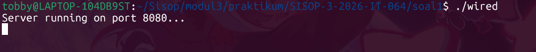

Jika nama sudah ada di The Wired  
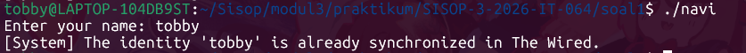

Selanjutnya output mekanisme broadcast  
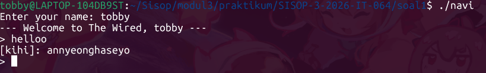
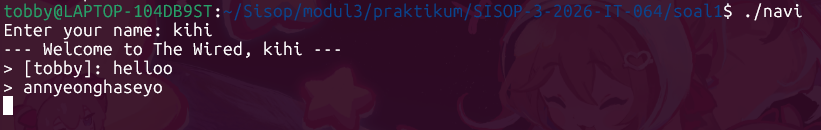

Jika user ingin disconnect  
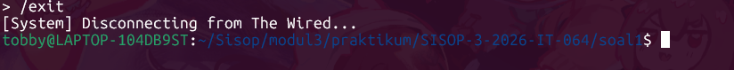

Selanjutnya, untuk user "The Knights" (Admin) Jika Benar  
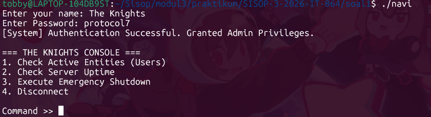

Selanjutnya, untuk user "The Knights" (Admin) Jika Salah  
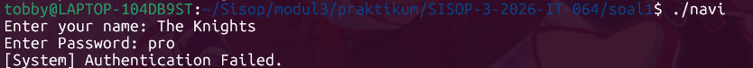

User "The Knights" (Admin) Pilih Opsi 1  
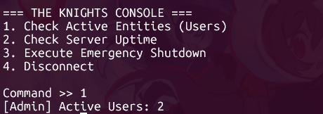

User "The Knights" (Admin) Pilih Opsi 2  


User "The Knights" (Admin) Pilih Opsi 3 (RPC_SHUTDOWN)  
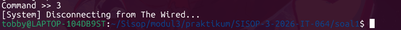

User "The Knights" (Admin) Pilih Opsi 4  
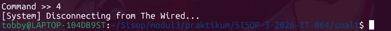

Kemudian untuk contoh isi File ``history.log``  
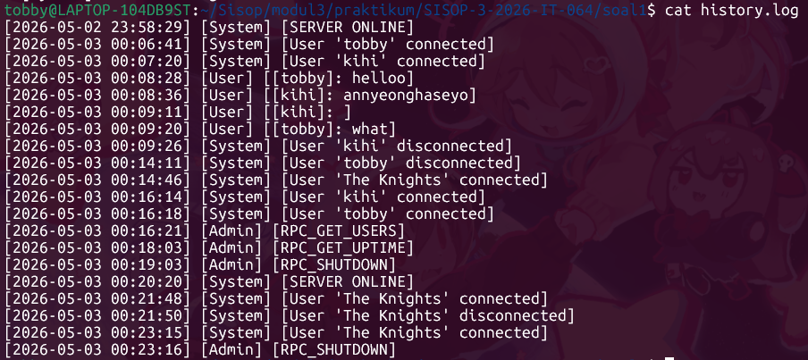

Demikian penjelasan terkait Soal 1 pada praktikum Sistem Operasi Modul 3 ini. Selanjutnya kita akan masuk ke penjelasan terkait Soal 2.


## Soal 2 - The Battle of Eterion
Pada soal ini diminta untuk membangun sebuah sistem permainan battle arena multiplayer berbasis terminal yang disebut Eterion. Sistem ini terdiri dari dua program terpisah yang saling berkomunikasi menggunakan mekanisme Inter-Process Communication (IPC) milik Linux, yaitu Shared Memory, Message Queue, dan Semaphore.

Beberapa program yang harus dibuat, yakni:  
- ``Makefile``  
File berguna untuk membantu saat proses debugging (opsional).  

- ``orion.c``  
Bertindak sebagai SERVER, mengelola seluruh state permainan, data pemain, antrian matchmaking, dan logika battle.  

- ``eternal.c``  
Bertindak sebagai CLIENT, menyediakan antarmuka terminal untuk pemain agar bisa register, login, masuk battle, membeli senjata, dan melihat riwayat.  

- ``arena.h``  
File header bersama yang mendefinisikan semua struct, konstanta, IPC keys, dan fungsi inline yang digunakan oleh program ``orion.c`` dan ``eternal.c``.

### Makefile
File ini dipergunakan untuk membantu dalam proses debugging. Setiap ingin run kedua program tersebut, gunakan ``make`` pada terminal untuk compile. Setiap menghentikan program, gunakan ``make clear_ipc`` untuk menghapus sisa shared memory.
```make
CC = gcc
CFLAGS = -Wall -pthread
LDFLAGS = -lrt

all: server client

server: orion.c arena.h
	$(CC) $(CFLAGS) orion.c -o orion $(LDFLAGS)

client: eternal.c arena.h
	$(CC) $(CFLAGS) eternal.c -o eternal $(LDFLAGS)

clean:
	rm -f orion eternal

clear_ipc:
	ipcs -m | grep 0x00001234 | awk '{print $$2}' | xargs -r ipcrm -m
	ipcs -q | grep 0x0000ABCD | awk '{print $$2}' | xargs -r ipcrm -q
	ipcs -s | grep 0x0000EF01 | awk '{print $$2}' | xargs -r ipcrm -s
	ipcs -s | grep 0x0000EF02 | awk '{print $$2}' | xargs -r ipcrm -s
	ipcs -s | grep 0x0000EF03 | awk '{print $$2}' | xargs -r ipcrm -s
	ipcs -m | grep 0x00005678 | awk '{print $$2}' | xargs -r ipcrm -m
	ipcs -m | grep 0x00009012 | awk '{print $$2}' | xargs -r ipcrm -m
```

### arena.h
Ini merupakan file header yang di-include oleh kedua program. File ini tidak berisi logika, melainkan hanya definisi bersama agar kedua program memiliki pemahaman yang sama terhadap struktur data dan protokol komunikasi.
#### Konstanta dan Konfigurasi Game
```h
// === IPC Keys ===
#define SHM_KEY_PLAYERS 0x00001234    // Shared memory: player data
#define SHM_KEY_BATTLES 0x00005678    // Shared memory: active battles
#define SHM_KEY_QUEUE 0x00009012    // Shared memory: matchmaking queue

#define MSG_KEY_MAIN 0x0000ABCD    // Message queue: client <to> server
#define SEM_KEY_PLAYERS 0x0000EF01    // Semaphore: player data
#define SEM_KEY_BATTLES 0x0000EF02    // Semaphore: battle data
#define SEM_KEY_QUEUE 0x0000EF03    // Semaphore: matchmaking queue

// === Game Configurations ===
#define MAX_PLAYERS 64
#define MAX_BATTLES 32
#define MAX_QUEUE 32
#define MAX_HISTORY 50
#define MAX_USERNAME 32
#define MAX_PASSWORD 32

#define BASE_DAMAGE 10
#define BASE_HEALTH 100
#define ATTACK_COOLDOWN 1   // in seconds
#define MATCHMAKING_TIMEOUT 35  // in seconds
```
Setiap konstanta dan variabel tersebut tentunya akan dipakai sesuai dengan fungsinya saat game berjalan.

#### Struct Weapon
```h
// === Weapon Configurations ===
#define NUM_WEAPONS 5

typedef struct {
    char name[32];
    int cost;
    int bonus_dmg;
} Weapon;

static const Weapon WEAPONS[NUM_WEAPONS] = {
    {"Wood Sword", 100, 5},
    {"Iron Sword", 300, 15},
    {"Steel Axe", 600, 30},
    {"Demon Blade", 1500, 60},
    {"God Slayer", 5000, 150},
};
```
Lima senjata dengan nama, harga, dan bonus damage. Diimplementasikan sebagai array ``static const`` global yang dapat diakses oleh semua modul.

#### Tipe Pesan dan Respons
```h
// === Message Types (for msg queue) ===
#define MSG_REGISTER 1
#define MSG_LOGIN 2
#define MSG_LOGOUT 3
#define MSG_MATCHMAKE 4
#define MSG_ATTACK 5
#define MSG_ULTIMATE 6
#define MSG_BUY_WEAPON 7
#define MSG_GET_HISTORY 8
#define MSG_CANCEL_MATCH 9

// Response Types (server -> client, mtype = client pid)
#define RESP_OK 100
#define RESP_FAIL 101
#define RESP_MATCH_FOUND 102
#define RESP_MATCH_TIMEOUT 103
#define RESP_BATTLE_UPDATE 104
#define RESP_BATTLE_END 105
#define RESP_HISTORY_DATA 106
#define RESP_MATCH_SEARCHING 107
```
Kode numerik yang digunakan pada ``.cmd`` dalam ``IpcMsg`` dan ``.status`` dalam ``IpcResp``. Pemisahan ini memudahkan server mengidentifikasi jenis permintaan dan klien mengetahui hasilnya tanpa perlu *parsing* string.

#### Struktur Data Utama
```h
// === Structs ===
typedef struct {
    char username[MAX_USERNAME];
    char password[MAX_PASSWORD];
    int gold;
    int lvl;
    int xp;
    int weapon_idx;     // if "-1" = unarmed, range between "0-4" = weapon index
    int in_use;         // if nilai 1 = active client connected
    pid_t pid;          // client Process ID when logged in
} Player;

typedef struct {
    char opponent[MAX_USERNAME];
    char result[8];     // either WIN or LOSS
    int xp_gained;
    time_t timestamp;
} MatchRecord;

// Extended player data and history stored in ShHM
typedef struct {
    Player p;
    MatchRecord history[MAX_HISTORY];
    int history_count;
} PlayerEntry;

typedef struct {
    int active;
    int player1_idx;  // index in players shared memory
    int player2_idx;  // if "-1" = bot
    int hp1;
    int hp2;
    time_t last_atk1;
    time_t last_atk2;
    int finished;       // if 0 = ongoing, if 1 = p1 wins, if 2 = p2 wins
    int max_hp1;
    int max_hp2;
    int last_dmg1;   // last damage from player1
    int last_dmg2;   // last damage from player2
    int last_ult1;   // 1 if last attack from p1 is ultimate
    int last_ult2;   // 1 if last attack from p2 is ultimate
} Battle;

typedef struct {
    pid_t pid;
    int player_idx;
    time_t join_time;
    int active;         // if 1 = waiting
} QueueEntry;

// === Shared Memory Layout ===
typedef struct {
    PlayerEntry entries[MAX_PLAYERS];
    int count;
} ShmPlayers;

typedef struct {
    Battle battles[MAX_BATTLES];
} ShmBattles;

typedef struct {
    QueueEntry queue[MAX_QUEUE];
    int size;
} ShmQueue;

// === Message Struct ===
typedef struct {
    long mtype;
    int cmd;            // MSG_* constant
    pid_t sender_pid;
    char data1[MAX_USERNAME];   // username or misc
    char data2[MAX_PASSWORD];   // password or misc
    int idata;                  // integer paylod (for weapon index, etc.)
} IpcMsg;

// Response Message (server -> client)
typedef struct {
    long mtype;         // client pid
    int status;         // RESP_* constant
    char msg[256];
    int idata;          // such as battle index, gold, etc.

    // Player Stats (for login and buy weaponry)
    int  p_gold;
    int  p_lvl;
    int  p_xp;
    int  p_weapon_idx;   // -1 = no weapon

    // Battle Snapshot
    int hp_self;
    int hp_opp;
    char opp_name[MAX_USERNAME];
    int opp_weapon;
    int self_weapon;
    int battle_over;    // if 0 = ongoing, 1 = won, 2 = lost

    int self_lvl;
    int opp_lvl;
    int last_dmg;    // last damage (0 = none)
    int is_ultimate;
    int  max_hp_self;
    int  max_hp_opp;

    // History Record (for RESP_HISTORY_DATA)
    MatchRecord rec;
    int history_total;
    int history_idx;
} IpcResp;
```
a) ``Player``: menyimpan username, password, gold, level, xp, indeks senjata, status in_use, dan PID proses klien.  
b) ``MatchRecord``: satu catatan pertempuran (lawan, hasil, XP, stempel waktu).  
c) ``PlayerEntry``: menggabungkan data pemain dengan array catatan sejarahnya.  
d) ``Battle``: merepresentasikan satu pertempuran aktif (indeks pemain 1 dan 2, HP, cooldown serangan, status selesai, serta last_dmg dan last_ult yang digunakan untuk combat log).  
e) ``QueueEntry``: elemen antrean matchmaking (PID, indeks pemain, waktu masuk, status aktif).  
f) ``ShmPlayers``, ``ShmBattles``, ``ShmQueue``: pembungkus array dengan penghitung untuk diletakkan di shared memory.  
g) ``IpcMsg`` dan ``IpcResp``: struktur pesan yang dikirim melalui message queue. ``IpcResp`` sangat fleksibel karena memuat statistik pemain, snapshot pertempuran, dan data sejarah.  

#### Semaphore Helper dan Game Logic
```h
// === Semaphore Helpers ===
static inline void sem_lock(int semid) {
    struct sembuf sb = {0, -1, SEM_UNDO};
    semop(semid, &sb, 1);
}
static inline void sem_unlock(int semid) {
    struct sembuf sb = {0, 1, SEM_UNDO};
    semop(semid, &sb, 1);
}

// === Game Logic Helper (compute player stats from base + XP + weapon) ===
static inline int calc_damage(int xp, int weapon_idx) {
    int bonus = (weapon_idx >= 0 && weapon_idx < NUM_WEAPONS) ? WEAPONS[weapon_idx].bonus_dmg : 0;
    return BASE_DAMAGE + (xp / 50) + bonus;
}
static inline int calc_health(int xp) {
    return BASE_HEALTH + (xp / 10);
}

#endif
```
a) ``sem_lock(semid)``: Melakukan operasi P (wait) pada semaphore. Memanggil semop() dengan nilai -1. Memblokir thread jika semaphore = 0.  
b) ``sem_unlock(semid)``: Melakukan operasi V (signal) pada semaphore. Memanggil semop() dengan nilai +1. Membangunkan thread yang menunggu.  
c) ``calc_damage(int xp, int weapon_idx)``: Menghitung damage aktual serangan normal.  
d) ``calc_health(int xp)``: Menghitung HP maksimum pemain.  

### orion.c
Program server yang berjalan sebagai proses tunggal dengan main loop yang terus menerima pesan dari message queue. Untuk operasi yang membutuhkan waktu (matchmaking, monitor battle, bot), server menjalankan thread terpisah agar main loop tidak terblokir.

#### Header & Define Lokasi SAVE_FILE
```c
#include "arena.h"
#include <errno.h>

#define SAVE_FILE "players.dat"
```

#### Variabel Global
```c
// === Globals (IPC IDs) ===
static int shm_id_players = -1;
static int shm_id_battles = -1;
static int shm_id_queue = -1;
static int msgq_id = -1;
static int sem_id_players = -1;
static int sem_id_battles = -1;
static int sem_id_queue = -1;
 
static ShmPlayers *shm_players = NULL;		// pointer shared memory
static ShmBattles *shm_battles = NULL;
static ShmQueue *shm_queue = NULL;
```
Semua ID sumber daya IPC (shared memory, message queue, semaphore) disimpan static global agar dapat diakses di seluruh fungsi tanpa harus dioper sebagai parameter. Di mana pointer ``shm_players``, ``shm_battles``, ``shm_queue`` menunjuk langsung ke segmen shared memory yang telah dipetakan.

#### Save Players
```c
// === Save ===
static void save_players(void) {
    sem_lock(sem_id_players);
    FILE *f = fopen(SAVE_FILE, "wb");
    if (f) {
        fwrite(shm_players, sizeof(ShmPlayers), 1, f);
        fclose(f);
    }
    sem_unlock(sem_id_players);
}
```
Fungsi menyimpan data pemain ke SAVE_FILE. Fungsi mengunci semafor pemain (``sem_id_players``) agar tidak ada perubahan bersamaan. Kemudian membuka ``players.dat`` untuk ditulis secara biner (``"wb"``). Lalu menulis seluruh isi ``ShmPlayers`` (semua akun dan riwayatnya) ke dalam satu operasi ``fwrite``. Setelah selesai, semafor dibuka kembali. Panggilan ini dilakukan setelah setiap perubahan data pemain (registrasi, logout, hasil pertempuran, pembelian senjata).

#### Load Players
```c
// === Load ===
static void load_players(void) {
    char cwd[256];
    getcwd(cwd, sizeof(cwd));

    FILE *f = fopen(SAVE_FILE, "rb");
    if (f) {
        size_t n = fread(shm_players, sizeof(ShmPlayers), 1, f);
        fclose(f);
        if (n != 1) {
            printf("[Orion] Save file corrupt, starting fresh.\n");
            shm_players->count = 0;
            return;
        }
        // Validate player count
        if (shm_players->count < 0 || shm_players->count > MAX_PLAYERS) {
            printf("[Orion] Save file invalid count=%d, starting fresh.\n",
                   shm_players->count);
            shm_players->count = 0;
            return;
        }
        // Reset all login state (in_use) when server starts
        for (int i = 0; i < shm_players->count; i++) {
            shm_players->entries[i].p.in_use = 0;
            shm_players->entries[i].p.pid    = 0;
        }
        printf("[Orion] Loaded %d player(s) from %s\n", shm_players->count, SAVE_FILE);
    } else {
        shm_players->count = 0;
        printf("[Orion] No save file found, starting fresh.\n");
    }
}
```
Fungsi membaca berkas ``players.dat`` ke dalam ``shm_players`` (yang sudah menunjuk ke shared memory). Jika berkas tidak ditemukan, server mulai dengan nol pemain. Jika pembacaan gagal atau jumlah pemain tidak valid, server mengosongkan data untuk mencegah korupsi. Semua status ``in_use`` dan ``pid`` direset ke ``0`` karena tidak ada klien yang sedang terhubung saat server baru menyala. Fungsi ini hanya dipanggil sekali saat inisialisasi server, tanpa penguncian semafor karena belum ada proses lain yang mengakses.

#### Find Player
```c
// === Find Player By Username ===
static int find_player(const char *username) {
    for (int i = 0; i < shm_players->count; i++) {
        if (strcmp(shm_players->entries[i].p.username, username) == 0) {
            return i;
        }
    }
    return -1;
}
```
Fungsi untuk mencari indeks pemain. Fungsi melakukan pencarian linear pada array ``entries`` berdasarkan ``username``. Selalu dipanggil di dalam blok yang sudah mengunci semafor pemain untuk keamanan. Dan akan mengembalikan indeks jika ditemukan, atau ``-1`` jika tidak ada.

#### send_resp
```c
// === Send Response Helper ===
static void send_resp(pid_t pid, int status, const char *msg, int idata) {
    IpcResp r;
    memset(&r, 0, sizeof(r));
    r.mtype  = (long)pid;
    r.status = status;
    r.idata  = idata;
    if (msg) strncpy(r.msg, msg, sizeof(r.msg) - 1);
    msgsnd(msgq_id, &r, sizeof(r) - sizeof(long), 0);
}
```
Fungsi membangun struktur ``IpcResp`` dengan tipe pesan sama dengan PID klien tujuan. Di sini status diisi dengan konstanta ``RESP_OK``, ``RESP_FAIL``, dll. Lalu, ``idata`` disini dapat membawa informasi tambahan (misal indeks pemain atau indeks pertempuran). Dan pesan dikirim ke message queue tanpa menunggu balasan.

#### Find Free Battle
```c
// === Find Free Battle Slot ===
static int find_free_battle(void) {
    for (int i = 0; i < MAX_BATTLES; i++) {
        if (!shm_battles->battles[i].active) {
            return i;
        }
    }
    return -1;
}
```
Fungsi ini baru akan dipanggil setelah mengunci ``sem_id_battles``. Fungsi ini mengembalikan indeks pertama di mana ``active == 0``, atau ``-1`` jika semua slot penuh.

#### Thread Bot
```c
// === Bot Thread (match with bot) ===
typedef struct {
    int battle_idx;
    int bot_slot;       // 1 = bot is player1, 2 = bot is player2
} BotArg;
 
static void *bot_thread(void *arg) {
    BotArg *ba = (BotArg *)arg;
    int bidx = ba->battle_idx;
    int bot_slot = ba->bot_slot;
    free(ba);
 
    while (1) {
        sem_lock(sem_id_battles);
        Battle *b = &shm_battles->battles[bidx];
 
        if (!b->active || b->finished) {
            sem_unlock(sem_id_battles);
            break;
        }
 
        time_t now = time(NULL);
        int    *opp_hp   = (bot_slot == 1) ? &b->hp2 : &b->hp1;
        time_t *bot_last = (bot_slot == 1) ? &b->last_atk1 : &b->last_atk2;
 
        if (now - *bot_last >= ATTACK_COOLDOWN) {
            int dmg = BASE_DAMAGE + (rand() % 5);   // Bot damage: random around base
            *opp_hp -= dmg;
            *bot_last = now;
 
            if (*opp_hp <= 0) {
                b->finished = (bot_slot == 1) ? 1 : 2;
            }
        }
 
        sem_unlock(sem_id_battles);
 
        if (shm_battles->battles[bidx].finished) {
            break;
        }
        usleep(300000);     // check every 0.3 seconds
    }
    return NULL;
}
```
Bot hanya akan diciptakan saat lawan adalah monster (``player2_idx == -1``). Parameter ``bot_slot`` menentukan apakah bot bermain sebagai pemain 1 atau pemain 2. Setiap 300 ms, bot memeriksa cooldown. Jika sudah waktunya, ia mengurangi HP lawan dengan damage acak (``BASE_DAMAGE + 0..4``). Jika HP lawan ≤ 0, bot menandai ``finished`` sesuai slotnya. Thread berhenti saat pertempuran tidak lagi aktif atau selesai.

#### Fungsi Bantu (``send_battle_update`` dan ``send_battle_end``)
```c
static void send_battle_update(int msgq, pid_t pid, Battle *b, 
                               int self_slot,   // 1 or 2
                               const char *opp_name, 
                               int self_weapon, int opp_weapon,
                               int self_lvl, int opp_lvl,
                               int last_dmg, int is_ultimate) {
    if (pid == 0)  {
        return;   // if is a bot
    }
    IpcResp r;
    memset(&r, 0, sizeof(r));
    r.mtype  = (long)pid;
    r.status = RESP_BATTLE_UPDATE;
    r.hp_self = (self_slot == 1) ? b->hp1 : b->hp2;
    r.hp_opp  = (self_slot == 1) ? b->hp2 : b->hp1;
    strncpy(r.opp_name, opp_name, MAX_USERNAME - 1);
    r.self_weapon = self_weapon;
    r.opp_weapon  = opp_weapon;
    r.battle_over = 0;
    r.self_lvl    = self_lvl;
    r.opp_lvl     = opp_lvl;
    r.last_dmg    = last_dmg;
    r.is_ultimate = is_ultimate;
    r.max_hp_self = (self_slot == 1) ? b->max_hp1 : b->max_hp2;
    r.max_hp_opp  = (self_slot == 1) ? b->max_hp2 : b->max_hp1;
    msgsnd(msgq, &r, sizeof(r) - sizeof(long), 0);
}

static void send_battle_end(int msgq, pid_t pid, int won, const char *opp_name,
                            int self_weapon, int opp_weapon, int hp_self, int hp_opp,
                            int self_lvl, int opp_lvl, int max_hp_self, int max_hp_opp) {
    if (pid == 0) {
        return;
    }
    IpcResp r;
    memset(&r, 0, sizeof(r));
    r.mtype       = (long)pid;
    r.status      = RESP_BATTLE_END;
    r.battle_over = won ? 1 : 2;
    r.hp_self     = hp_self;
    r.hp_opp      = hp_opp;
    strncpy(r.opp_name, opp_name, MAX_USERNAME - 1);
    r.self_weapon = self_weapon;
    r.opp_weapon  = opp_weapon;
    r.self_lvl    = self_lvl;
    r.opp_lvl     = opp_lvl;
    r.max_hp_self = max_hp_self;
    r.max_hp_opp  = max_hp_opp;
    msgsnd(msgq, &r, sizeof(r) - sizeof(long), 0);
}
```
Keduanya mengirimkan snapshot pertempuran ke satu klien melalui message queue. Fungsi ``send_battle_update`` mengisi ``IpcResp`` dengan ``RESP_BATTLE_UPDATE``, memuat HP, nama lawan, senjata, level, kerusakan terakhir (``last_dmg``), apakah itu ultimate, dan HP maksimal. Fungsi ``send_battle_end`` serupa, namun dengan ``RESP_BATTLE_END`` dan penanda ``battle_over`` (1 menang, 2 kalah). Keduanya mengabaikan ``pid == 0`` (bot tidak menerima pesan).

#### Thread Pemantau Battle
```c
static void *battle_thread(void *arg) {
    BattleArg *ba = (BattleArg *)arg;
    int bidx  = ba->battle_idx;
    int p1idx = ba->p1_idx;
    int p2idx = ba->p2_idx;
    pid_t pid1 = ba->pid1;
    pid_t pid2 = ba->pid2;
    free(ba);
 
    // Get name, weapon, and lvl of both player
    char name1[MAX_USERNAME], name2[MAX_USERNAME];
    int  wpn1, wpn2, lvl1, lvl2;
 
    sem_lock(sem_id_players);
    strncpy(name1, shm_players->entries[p1idx].p.username, MAX_USERNAME - 1);
    wpn1 = shm_players->entries[p1idx].p.weapon_idx;
    lvl1 = shm_players->entries[p1idx].p.lvl;
    if (p2idx >= 0) {
        strncpy(name2, shm_players->entries[p2idx].p.username, MAX_USERNAME - 1);
        wpn2 = shm_players->entries[p2idx].p.weapon_idx;
        lvl2 = shm_players->entries[p2idx].p.lvl;
    } else {
        strncpy(name2, "Wild Beast", MAX_USERNAME - 1);
        wpn2 = -1;
        lvl2 = 1;
    }
    sem_unlock(sem_id_players);
 
    // Send the first update
    sem_lock(sem_id_battles);
    Battle *b = &shm_battles->battles[bidx];
    send_battle_update(msgq_id, pid1, b, 1, name2, wpn1, wpn2, lvl1, lvl2, 0, 0);
    if (pid2) {
        send_battle_update(msgq_id, pid2, b, 2, name1, wpn2, wpn1, lvl2, lvl1, 0, 0);
    }
    sem_unlock(sem_id_battles);
 
    // Monitor loop
    int update_tick = 0;
    while (1) {
        usleep(100000);     // 100ms
 
        sem_lock(sem_id_battles);
        b = &shm_battles->battles[bidx];
 
        if (!b->active) {
            sem_unlock(sem_id_battles); 
            break;
        }
 
        if (b->finished) {
            int p1_won = (b->finished == 1);
            int p2_won = (b->finished == 2);
 
            send_battle_end(msgq_id, pid1, p1_won, name2, wpn1, wpn2, b->hp1, b->hp2, 
                           lvl1, lvl2, b->max_hp1, b->max_hp2);

            if (pid2) send_battle_end(msgq_id, pid2, p2_won, name1, wpn2, wpn1, b->hp2, b->hp1, 
                           lvl2, lvl1, b->max_hp2, b->max_hp1);
 
            // Update stats
            sem_unlock(sem_id_battles);
            sem_lock(sem_id_players);
 
            PlayerEntry *e1 = &shm_players->entries[p1idx];
            // XP & gold
            int xp1 = p1_won ? 50 : 15;
            int xp2 = p2_won ? 50 : 15;
            int g1  = p1_won ? 120 : 30;
            int g2  = p2_won ? 120 : 30;
 
            e1->p.xp   += xp1;
            e1->p.gold += g1;
            if (e1->p.xp >= e1->p.lvl * 100) {
                e1->p.lvl++;
            }
 
            // History for p1
            if (e1->history_count < MAX_HISTORY) {
                MatchRecord *rec = &e1->history[e1->history_count++];
                strncpy(rec->opponent, name2, MAX_USERNAME - 1);
                strncpy(rec->result, p1_won ? "WIN" : "LOSS", 7);
                rec->xp_gained  = xp1;
                rec->timestamp  = time(NULL);
            }
 
            if (p2idx >= 0) {
                PlayerEntry *e2 = &shm_players->entries[p2idx];
                e2->p.xp   += xp2;
                e2->p.gold += g2;
                if (e2->p.xp >= e2->p.lvl * 100) {
                    e2->p.lvl++;
                }
 
                if (e2->history_count < MAX_HISTORY) {
                    MatchRecord *rec = &e2->history[e2->history_count++];
                    strncpy(rec->opponent, name1, MAX_USERNAME - 1);
                    strncpy(rec->result, p2_won ? "WIN" : "LOSS", 7);
                    rec->xp_gained  = xp2;
                    rec->timestamp  = time(NULL);
                }
            }
 
            sem_unlock(sem_id_players);
            save_players();
 
            // Cleanup battle
            sem_lock(sem_id_battles);
            shm_battles->battles[bidx].active = 0;
            sem_unlock(sem_id_battles);
            break;
        }

        // Send HP update to client (only if battle isnt finished)
        update_tick++;
        if (update_tick % 3 == 0) {     // every ~300ms
            // Get and reset last_dmg so it only appears onece in combat log
            int dmg1 = b->last_dmg1; b->last_dmg1 = 0;
            int dmg2 = b->last_dmg2; b->last_dmg2 = 0;
            int ult1 = b->last_ult1; b->last_ult1 = 0;
            int ult2 = b->last_ult2; b->last_ult2 = 0;

            send_battle_update(msgq_id, pid1, b, 1, name2, wpn1, wpn2, lvl1, lvl2, dmg1, ult1);
            if (pid2) send_battle_update(msgq_id, pid2, b, 2, name1, wpn2, wpn1, lvl2, lvl1, dmg2, ult2);
        }

        sem_unlock(sem_id_battles);
    }
    return NULL;
}
```
Thread ini dibuat setelah pertempuran dimulai. Thread mengambil data statis (nama, senjata) di awal agar tidak perlu mengunci semafor pemain terus-menerus. Setiap 100 ms, ia memeriksa apakah pertempuran masih berjalan. Jika ``finished`` terdeteksi, ia mengirim ``RESP_BATTLE_END`` ke semua pemain, memperbarui XP/gold/history, menyimpan data, dan menonaktifkan slot pertempuran. Setiap 300 ms, ia mengirim ``RESP_BATTLE_UPDATE`` dengan nilai ``last_dmg`` yang baru saja terjadi, lalu meresetnya agar tidak muncul berulang di log klien.

#### Start Battle
```c
static void start_battle(int p1idx, pid_t pid1, int p2idx, pid_t pid2) {
    sem_lock(sem_id_battles);
    int bidx = find_free_battle();
    if (bidx < 0) {
        sem_unlock(sem_id_battles);
        send_resp(pid1, RESP_FAIL, "No battle slot available.", 0);
        if (pid2) send_resp(pid2, RESP_FAIL, "No battle slot available.", 0);
        return;
    }

    Battle *b = &shm_battles->battles[bidx];
    memset(b, 0, sizeof(Battle));
    b->active     = 1;
    b->player1_idx = p1idx;
    b->player2_idx = p2idx;
 
    sem_lock(sem_id_players);
    b->hp1 = calc_health(shm_players->entries[p1idx].p.xp);
    b->hp2 = (p2idx >= 0)
             ? calc_health(shm_players->entries[p2idx].p.xp)
             : BASE_HEALTH;
    b->max_hp1 = b->hp1;
    b->max_hp2 = b->hp2;
    sem_unlock(sem_id_players);
 
    b->last_atk1 = 0;
    b->last_atk2 = 0;
    b->finished   = 0;
    sem_unlock(sem_id_battles);
 
    // Notify clients
    char buf[64];
    snprintf(buf, sizeof(buf), "BATTLE_START:%d", bidx);
    send_resp(pid1, RESP_MATCH_FOUND, buf, bidx);
    if (pid2) send_resp(pid2, RESP_MATCH_FOUND, buf, bidx);
 
    // Start bot thread if p2 is bot
    if (p2idx < 0) {
        BotArg *ba = malloc(sizeof(BotArg));
        ba->battle_idx = bidx;
        ba->bot_slot   = 2;
        pthread_t bt;
        pthread_create(&bt, NULL, bot_thread, ba);
        pthread_detach(bt);
    }
 
    // Start monitor thread
    BattleArg *barg = malloc(sizeof(BattleArg));
    barg->battle_idx = bidx;
    barg->p1_idx     = p1idx;
    barg->p2_idx     = p2idx;
    barg->pid1       = pid1;
    barg->pid2       = pid2;
    pthread_t mt;
    pthread_create(&mt, NULL, battle_thread, barg);
    pthread_detach(mt);
}
```
Fungsi akan menyiapkan struktur ``Battle`` di slot kosong, mengisi HP pemain. Kemudian fungsi memanggil ``send_resp`` dengan ``RESP_MATCH_FOUND`` agar klien tahu indeks battle. Ia akan menjalankan ``bot_thread`` jika lawan bot, dan selalu menjalankan ``battle_thread`` untuk distribusi data.

#### Thread Matchmaking
```c
static void *matchmaking_thread(void *arg) {
    MatchArg *ma = (MatchArg *)arg;
    int    my_idx   = ma->player_idx;
    pid_t  my_pid   = ma->pid;
    int    my_qslot = ma->queue_slot;
    free(ma);
 
    // Send "searching" acknowledgment to client
    send_resp(my_pid, RESP_MATCH_SEARCHING, "Searching for an opponent...", 0);
 
    time_t deadline = time(NULL) + MATCHMAKING_TIMEOUT;
 
    while (time(NULL) < deadline) {
        sleep(1);
 
        sem_lock(sem_id_queue);
 
        // Check if player is still in queue
        if (!shm_queue->queue[my_qslot].active) {
            sem_unlock(sem_id_queue);
            return NULL;
        }
 
        // Look for another waiting player
        for (int i = 0; i < MAX_QUEUE; i++) {
            if (i == my_qslot) continue;
            if (!shm_queue->queue[i].active) continue;
 
            int opp_pidx = shm_queue->queue[i].player_idx;
            pid_t opp_pid = shm_queue->queue[i].pid;
 
            // Pair found, then remove both from queue
            shm_queue->queue[my_qslot].active = 0;
            shm_queue->queue[i].active        = 0;
            shm_queue->size -= 2;
            sem_unlock(sem_id_queue);
 
            start_battle(my_idx, my_pid, opp_pidx, opp_pid);
            return NULL;
        }
 
        sem_unlock(sem_id_queue);
    }
 
    // Timeout, then remove from queue and match with bot instead
    sem_lock(sem_id_queue);
    shm_queue->queue[my_qslot].active = 0;
    shm_queue->size--;
    sem_unlock(sem_id_queue);
 
    start_battle(my_idx, my_pid, -1, 0);
    return NULL;
}
```
Setiap detik, thread akan memeriksa antrean secara berkala. Jika pemain sudah tidak aktif (mungkin dibatalkan), thread akan keluar. Jika ada pemain lain di antrean, keduanya dikeluarkan dan ``start_battle`` dipanggil dengan kedua pemain tersebut sehingga battle pun langsung berjalan. Jika waktu 35 detik tersebut habis, maka pemain akan keluar dari antrean dan langsung bertanding melawan bot.

#### handle_register
```c
static void handle_register(IpcMsg *req) {
    sem_lock(sem_id_players);
 
    if (shm_players->count >= MAX_PLAYERS) {
        sem_unlock(sem_id_players);
        send_resp(req->sender_pid, RESP_FAIL, "Server full.", 0);
        return;
    }
 
    if (find_player(req->data1) >= 0) {
        sem_unlock(sem_id_players);
        send_resp(req->sender_pid, RESP_FAIL, "Username already taken.", 0);
        return;
    }
 
    int idx = shm_players->count++;
    PlayerEntry *e = &shm_players->entries[idx];
    memset(e, 0, sizeof(PlayerEntry));
    strncpy(e->p.username, req->data1, MAX_USERNAME - 1);
    strncpy(e->p.password, req->data2, MAX_PASSWORD - 1);
    e->p.gold       = 150;
    e->p.lvl        = 1;
    e->p.xp         = 0;
    e->p.weapon_idx = -1;
    e->p.in_use     = 0;
 
    sem_unlock(sem_id_players);
    save_players();
    send_resp(req->sender_pid, RESP_OK, "Account created!", 0);
}
```
Fungsi ini menangani pembuatan akun baru. Setelah mengunci semafor pemain melalui ``sem_lock(sem_id_players)``, server memeriksa apakah jumlah pemain sudah mencapai ``MAX_PLAYERS`` atau username yang dikirim di ``req->data1`` sudah terdaftar dengan memanggil ``find_player``. Jika batas terlampaui atau nama sudah ada, kunci dilepas dan klien langsung menerima respons ``RESP_FAIL`` berisi pesan penolakan seperti ``"Server full."`` atau ``"Username already taken."``. Apabila validasi lolos, indeks baru diambil dari ``shm_players->count++`` dan entri ``PlayerEntry`` diinisialisasi dengan ``memset`` lalu diisi username dan password dari ``req->data1`` dan ``req->data2``. Nilai awal ditetapkan: ``gold = 150``, ``lvl = 1``, ``xp = 0``, ``weapon_idx = -1``. Setelah semafor dilepas, ``save_players`` segera dipanggil untuk menulis perubahan ke berkas ``players.dat``, kemudian ``send_resp`` mengirimkan ``RESP_OK`` dengan pesan "Account created!". Seluruh proses diproteksi semafor sehingga tidak mungkin dua proses menulis indeks yang sama secara bersamaan.

#### handle_login
```c
static void handle_login(IpcMsg *req) {
    sem_lock(sem_id_players);
    int idx = find_player(req->data1);
    if (idx < 0) {
        sem_unlock(sem_id_players);
        send_resp(req->sender_pid, RESP_FAIL, "User not found.", 0);
        return;
    }
 
    PlayerEntry *e = &shm_players->entries[idx];
    if (strcmp(e->p.password, req->data2) != 0) {
        sem_unlock(sem_id_players);
        send_resp(req->sender_pid, RESP_FAIL, "Wrong password.", 0);
        return;
    }
 
    if (e->p.in_use) {
        sem_unlock(sem_id_players);
        send_resp(req->sender_pid, RESP_FAIL, "Account already logged in.", 0);
        return;
    }
 
    e->p.in_use = 1;
    e->p.pid    = req->sender_pid;

    // Prepare response with full player data
    IpcResp r;
    memset(&r, 0, sizeof(r));
    r.mtype       = (long)req->sender_pid;
    r.status      = RESP_OK;
    r.idata       = idx;
    r.p_gold      = e->p.gold;
    r.p_lvl       = e->p.lvl;
    r.p_xp        = e->p.xp;
    r.p_weapon_idx = e->p.weapon_idx;
    strncpy(r.msg, "Welcome!", sizeof(r.msg) - 1);

    sem_unlock(sem_id_players);
    msgsnd(msgq_id, &r, sizeof(r) - sizeof(long), 0);
}
```
Fungsi ini memproses autentikasi pemain. Setelah mengunci ``sem_id_players``, server mencari indeks pemain berdasarkan ``req->data1`` lewat ``find_player``. Jika indeks tidak ditemukan, respons ``RESP_FAIL`` dengan ``"User not found."`` dikirim dan kunci dilepas. Bila pengguna ditemukan, server membandingkan ``req->data2`` dengan ``e->p.password``, ketidakcocokan menghasilkan respons ``"Wrong password."``. Langkah berikutnya memeriksa ``e->p.in_use``, jika bernilai ``1``, artinya akun sedang dipakai oleh klien lain, dan respons ``"Account already logged in."`` dikembalikan. Hanya ketika semua syarat terpenuhi, server menandai ``e->p.in_use = 1`` dan menyimpan ``req->sender_pid`` sebagai ``e->p.pid``. Alih-alih menggunakan ``send_resp``, server membangun struktur ``IpcResp`` secara manual dengan ``mtype`` sama dengan PID klien, ``status = RESP_OK``, serta ``idata`` berisi indeks pemain. Seluruh data pemain (``p_gold``, ``p_lvl``, ``p_xp``, ``p_weapon_idx``) turut disertakan agar klien dapat menyinkronkan status lokal. Setelah ``msgsnd`` mengirimkan respons, semafor dilepas. Fungsi ini menjamin bahwa sesi login bersifat eksklusif. Bahwa, tidak ada dua entitas yang dapat masuk dengan akun yang sama dalam waktu bersamaan.

#### handle_logout
```c
static void handle_logout(IpcMsg *req) {
    sem_lock(sem_id_players);
    int idx = find_player(req->data1);
    if (idx >= 0) {
        shm_players->entries[idx].p.in_use = 0;
        shm_players->entries[idx].p.pid    = 0;
    }
    sem_unlock(sem_id_players);
    save_players();
    send_resp(req->sender_pid, RESP_OK, "Logged out.", 0);
}
```
Fungsi ini mencatat keluarnya pemain. Server mengunci ``sem_id_players``, mencari indeks pemain dengan ``find_player`` menggunakan ``req->data1``, dan jika ditemukan, mengatur ``in_use`` ke ``0`` serta pid ke ``0``. Setelah semafor dilepas, perubahan disimpan permanen melalui ``save_players`` dan klien menerima ``send_resp(req->sender_pid``, ``RESP_OK``, ``"Logged out.", 0)``. Dengan mekanisme ini, akun kembali tersedia untuk login dari tempat lain setelah pemain keluar.

#### handle_matchmake
```c
static void handle_matchmake(IpcMsg *req) {
    int pidx = req->idata;          // player index sent by client
 
    // Check player already in battle
    sem_lock(sem_id_battles);
    for (int i = 0; i < MAX_BATTLES; i++) {
        Battle *b = &shm_battles->battles[i];
        if (b->active && !b->finished && (b->player1_idx == pidx || b->player2_idx == pidx)) {
            sem_unlock(sem_id_battles);
            send_resp(req->sender_pid, RESP_FAIL, "Already in a battle.", 0);
            return;
        }
    }
    sem_unlock(sem_id_battles);
 
    // Add to queue
    sem_lock(sem_id_queue);
    int slot = -1;
    for (int i = 0; i < MAX_QUEUE; i++) {
        if (!shm_queue->queue[i].active) {
            slot = i;
            break;
        }
    }
    if (slot < 0) {
        sem_unlock(sem_id_queue);
        send_resp(req->sender_pid, RESP_FAIL, "Queue full.", 0);
        return;
    }
    shm_queue->queue[slot].pid        = req->sender_pid;
    shm_queue->queue[slot].player_idx = pidx;
    shm_queue->queue[slot].join_time  = time(NULL);
    shm_queue->queue[slot].active     = 1;
    shm_queue->size++;
    sem_unlock(sem_id_queue);
 
    // Spawn matchmaking thread
    MatchArg *ma = malloc(sizeof(MatchArg));
    ma->player_idx = pidx;
    ma->pid        = req->sender_pid;
    ma->join_time  = time(NULL);
    ma->queue_slot = slot;
    pthread_t t;
    pthread_create(&t, NULL, matchmaking_thread, ma);
    pthread_detach(t);
}
```
Fungsi ini mendaftarkan pemain ke dalam antrean pencarian lawan. Indeks pemain diambil dari ``req->idata``. Pertama, server mengunci ``sem_id_battles`` dan memeriksa seluruh slot ``Battle``, jika pemain sedang dalam pertempuran aktif (``active && !finished``), permintaan ditolak dengan ``RESP_FAIL`` berisi ``"Already in a battle."``. Setelah itu server beralih ke ``sem_id_queue``, mencari slot kosong di ``shm_queue->queue``, mengisinya dengan pid, ``player_idx``, ``join_time``, dan menandai ``active = 1``, serta menambah ``size``. Apabila antrean penuh, ``RESP_FAIL`` dengan ``"Queue full."`` dikirim. Bila slot berhasil didapat, server melepaskan kunci dan membuat thread ``matchmaking_thread`` dengan argumen ``MatchArg`` yang dialokasikan secara dinamis. Thread ini akan berjalan terpisah sehingga loop utama server tidak terblokir selama pencarian lawan.

#### handle_attack
```c
static void handle_attack(IpcMsg *req) {
    int bidx = req->idata;
    int pidx;
 
    sem_lock(sem_id_players);
    pidx = find_player(req->data1);
    int xp   = (pidx >= 0) ? shm_players->entries[pidx].p.xp   : 0;
    int wpn  = (pidx >= 0) ? shm_players->entries[pidx].p.weapon_idx : -1;
    sem_unlock(sem_id_players);
 
    if (pidx < 0 || bidx < 0 || bidx >= MAX_BATTLES) {
        send_resp(req->sender_pid, RESP_FAIL, "Invalid attack.", 0);
        return;
    }
 
    sem_lock(sem_id_battles);
    Battle *b = &shm_battles->battles[bidx];
 
    if (!b->active || b->finished) {
        sem_unlock(sem_id_battles);
        send_resp(req->sender_pid, RESP_FAIL, "Battle not active.", 0);
        return;
    }
 
    int self_slot = (b->player1_idx == pidx) ? 1 : 2;
    time_t *last_atk = (self_slot == 1) ? &b->last_atk1 : &b->last_atk2;
    int    *opp_hp   = (self_slot == 1) ? &b->hp2 : &b->hp1;
 
    time_t now = time(NULL);
    if (now - *last_atk < ATTACK_COOLDOWN) {
        sem_unlock(sem_id_battles);
        send_resp(req->sender_pid, RESP_FAIL, "Cooldown active.", 0);
        return;
    }
 
    int dmg    = calc_damage(xp, wpn);
    *opp_hp   -= dmg;
    *last_atk  = now;
    
    // Keep damage info for combat log client
    if (self_slot == 1) {
        b->last_dmg1 = dmg; b->last_ult1 = 0;
    } else {
        b->last_dmg2 = dmg; b->last_ult2 = 0;
    }

    if (*opp_hp <= 0) {
        b->finished = self_slot;    // if self_slot wins
    }
 
    sem_unlock(sem_id_battles);
    // Battle monitor thread will then send an update
}
```
Fungsi ini menangani serangan biasa dari pemain selama pertempuran. Server mencari indeks pemain di ``shm_players`` dan mengambil ``xp`` serta ``weapon_idx`` untuk perhitungan ``calc_damage``. Parameter ``req->idata`` membawa indeks pertempuran. Setelah mengunci ``sem_id_battles``, server memvalidasi bahwa ``Battle`` pada indeks tersebut masih aktif dan belum selesai. Slot pemain ditentukan dengan mencocokkan indeks pemain terhadap ``player1_idx`` atau ``player2_idx``. Cooldown dicek dengan membandingkan ``time(NULL) - *last_atk`` terhadap ``ATTACK_COOLDOWN``; bila belum melewati ``1`` detik, respons ``RESP_FAIL`` dengan ``"Cooldown active."`` dikirim. Jika cooldown terpenuhi, kerusakan dihitung dengan ``calc_damage(xp, wpn)``, HP lawan dikurangi, waktu serangan terakhir diperbarui, dan ``last_dmg1``/``last_dmg2`` serta ``last_ult1``/``last_ult2`` diisi sesuai slot. Bila HP lawan mencapai kurang dari sama dengan ``0``, ``b->finished`` ditandai dengan nomor slot pemenang.

#### handle_ultimate
```c
static void handle_ultimate(IpcMsg *req) {
    int bidx = req->idata;
    int pidx;
 
    sem_lock(sem_id_players);
    pidx = find_player(req->data1);
    int xp  = (pidx >= 0) ? shm_players->entries[pidx].p.xp  : 0;
    int wpn = (pidx >= 0) ? shm_players->entries[pidx].p.weapon_idx : -1;
    sem_unlock(sem_id_players);
 
    if (pidx < 0 || wpn < 0) {
        send_resp(req->sender_pid, RESP_FAIL, "No weapon equipped for Ultimate!", 0);
        return;
    }
 
    sem_lock(sem_id_battles);
    Battle *b = &shm_battles->battles[bidx];
 
    if (!b->active || b->finished) {
        sem_unlock(sem_id_battles);
        send_resp(req->sender_pid, RESP_FAIL, "Battle not active.", 0);
        return;
    }
 
    int self_slot = (b->player1_idx == pidx) ? 1 : 2;
    time_t *last_atk = (self_slot == 1) ? &b->last_atk1 : &b->last_atk2;
    int    *opp_hp   = (self_slot == 1) ? &b->hp2 : &b->hp1;
 
    time_t now = time(NULL);
    if (now - *last_atk < ATTACK_COOLDOWN) {
        sem_unlock(sem_id_battles);
        send_resp(req->sender_pid, RESP_FAIL, "Cooldown active.", 0);
        return;
    }
 
    int base_dmg = calc_damage(xp, wpn);
    int ult_dmg  = base_dmg * 3;
    *opp_hp    -= ult_dmg;
    *last_atk   = now;
    
    // Keep damage info for combat log client
    if (self_slot == 1) {
        b->last_dmg1 = ult_dmg; b->last_ult1 = 1;
    } else {
        b->last_dmg2 = ult_dmg; b->last_ult2 = 1;
    }

    if (*opp_hp <= 0) {
        b->finished = self_slot;
    }
 
    sem_unlock(sem_id_battles);
}
```
Fungsi ini serupa dengan ``handle_attack``, tetapi dikhususkan untuk serangan ulti. Setelah memvalidasi bahwa pemain ditemukan dan memiliki senjata (``weapon_idx >= 0``), server menjalankan pengecekan yang sama terhadap status pertempuran dan cooldown. Kerusakan dihitung sebagai ``calc_damage(xp, wpn) * 3``. Nilai ``last_dmg`` dan ``last_ult`` disetel dengan ``ult_dmg`` dan flag ``1`` agar thread pemantau dapat menampilkan informasi serangan ultimate di log pertempuran klien. Pengurangan HP dan penentuan akhir pertempuran berlangsung identik dengan ``handle_attack``.

#### handle_buy_weapon
```c
static void handle_buy_weapon(IpcMsg *req) {
    int wpn_idx = req->idata;
    if (wpn_idx < 0 || wpn_idx >= NUM_WEAPONS) {
        send_resp(req->sender_pid, RESP_FAIL, "Invalid weapon.", 0);
        return;
    }
 
    sem_lock(sem_id_players);
    int pidx = find_player(req->data1);
    if (pidx < 0) {
        sem_unlock(sem_id_players);
        send_resp(req->sender_pid, RESP_FAIL, "Player not found.", 0);
        return;
    }
 
    PlayerEntry *e = &shm_players->entries[pidx];
    int cost = WEAPONS[wpn_idx].cost;
    
    // Check if weapon is already owned
    if (e->p.weapon_idx == wpn_idx) {
        sem_unlock(sem_id_players);
        send_resp(req->sender_pid, RESP_FAIL, "You already own this weapon.", 0);
        return;
    }

    if (e->p.gold < cost) {
        sem_unlock(sem_id_players);
        send_resp(req->sender_pid, RESP_FAIL, "Not enough gold.", 0);
        return;
    }
 
    e->p.gold -= cost;

    // Always equip the weapon with the highest damage
    if (e->p.weapon_idx < 0 || WEAPONS[wpn_idx].bonus_dmg > WEAPONS[e->p.weapon_idx].bonus_dmg) {
        e->p.weapon_idx = wpn_idx;
    }
 
    int new_gold = e->p.gold;
    int new_weapon = e->p.weapon_idx;
    sem_unlock(sem_id_players);
    save_players();

    // Send response with the latest gold and weapon
    IpcResp r;
    memset(&r, 0, sizeof(r));
    r.mtype        = (long)req->sender_pid;
    r.status       = RESP_OK;
    r.idata        = new_gold;
    r.p_gold       = new_gold;
    r.p_weapon_idx = new_weapon;
    snprintf(r.msg, sizeof(r.msg), "Bought %s! Gold: %d", WEAPONS[wpn_idx].name, new_gold);
    msgsnd(msgq_id, &r, sizeof(r) - sizeof(long), 0);
}
```
Fungsi ini memproses pembelian senjata dari Armory. Indeks senjata dibawa oleh ``req->idata``. Server memvalidasi indeks berada dalam jangkauan ``0..NUM_WEAPONS-1``, lalu mengunci ``sem_id_players`` dan mencari pemain. Setelah memastikan pemain ada, server membandingkan harga ``WEAPONS[wpn_idx].cost`` dengan ``e->p.gold``. Jika emas tidak mencukupi, ``RESP_FAIL`` dengan ``"Not enough gold."`` dikirim. Jika emas cukup, jumlah emas dikurangi dan sistem memeriksa apakah senjata baru memiliki ``bonus_dmg`` lebih tinggi daripada senjata yang sedang dipakai (atau pemain belum punya senjata). Hanya dalam kondisi itulah ``e->p.weapon_idx`` diperbarui, sehingga pemain **selalu otomatis memakai senjata dengan damage terbesar**. Setelah kunci dilepas dan ``save_players`` dipanggil, server membangun ``IpcResp`` dengan ``mtype`` klien, ``status = RESP_OK``, ``p_gold`` dan ``p_weapon_idx`` terbaru, serta pesan yang menyebutkan nama senjata dan sisa emas.

#### handle_get_history
```c
static void handle_get_history(IpcMsg *req) {
    sem_lock(sem_id_players);
    int pidx = find_player(req->data1);
    if (pidx < 0) {
        sem_unlock(sem_id_players);
        send_resp(req->sender_pid, RESP_FAIL, "Player not found.", 0);
        return;
    }
 
    PlayerEntry *e = &shm_players->entries[pidx];
    int total = e->history_count;
 
    // Send each record as a separate message
    for (int i = total - 1; i >= 0 && i >= total - MAX_HISTORY; i--) {
        IpcResp r;
        memset(&r, 0, sizeof(r));
        r.mtype        = (long)req->sender_pid;
        r.status       = RESP_HISTORY_DATA;
        r.rec          = e->history[i];
        r.history_total = total;
        r.history_idx   = total - 1 - i;
        msgsnd(msgq_id, &r, sizeof(r) - sizeof(long), 0);
    }
 
    sem_unlock(sem_id_players);
 
    // Sentinel, end of history
    IpcResp end;
    memset(&end, 0, sizeof(end));
    end.mtype        = (long)req->sender_pid;
    end.status       = RESP_OK;
    end.history_total = total;
    end.history_idx   = -1;     // this one is sentinel
    msgsnd(msgq_id, &end, sizeof(end) - sizeof(long), 0);
}
```
Fungsi ini mengirimkan riwayat pertempuran seorang pemain. Setelah mengunci ``sem_id_players``, server mencari indeks pemain dan mengakses ``PlayerEntry`` yang bersangkutan. Setiap catatan di dalam ``history[]`` dikirim secara terbalik (dari yang terbaru) menggunakan perulangan mundur dari ``total-1`` hingga ``0``, dengan batas maksimum ``MAX_HISTORY``. Setiap rekaman dibungkus dalam ``IpcResp`` dengan ``status = RESP_HISTORY_DATA`` dan ``rec`` berisi data ``MatchRecord``, serta ``history_total`` dan ``history_idx`` yang menunjukkan posisi kiriman. Setelah semua catatan terkirim, server mengirim sinyal akhir berupa ``IpcResp`` dengan ``status = RESP_OK`` dan ``history_idx = -1`` sebagai penanda bahwa tidak ada lagi data. Klien membaca berulang sampai menemukan sentinel tersebut.

#### Clean Up dan Signal Handler
```c
// === Clean Up ===
static void cleanup(void) {
    save_players();
    printf("\n[Orion] Cleaning up IPC...\n");
 
    if (shm_players) shmdt(shm_players);
    if (shm_battles) shmdt(shm_battles);
    if (shm_queue)   shmdt(shm_queue);
 
    if (shm_id_players >= 0) shmctl(shm_id_players, IPC_RMID, NULL);
    if (shm_id_battles >= 0) shmctl(shm_id_battles, IPC_RMID, NULL);
    if (shm_id_queue   >= 0) shmctl(shm_id_queue,   IPC_RMID, NULL);
    if (msgq_id        >= 0) msgctl(msgq_id, IPC_RMID, NULL);
    if (sem_id_players >= 0) semctl(sem_id_players, 0, IPC_RMID);
    if (sem_id_battles >= 0) semctl(sem_id_battles, 0, IPC_RMID);
    if (sem_id_queue   >= 0) semctl(sem_id_queue,   0, IPC_RMID);
}

static void sighandler(int sig) {
    (void)sig;
    cleanup();
    exit(0);
}
```
Fungsi ``cleanup`` di sini melepas shared memory dan menghancurkan seluruh sumber daya IPC.Kemudian fungsi ``sighandler`` ditangkap untuk ``SIGINT/SIGTERM`` sehingga server selalu membersihkan lingkungan sebelum mati.

#### Main Function
- Inisialisasi Awal dan Penanganan Sinyal
```c
int main(void) {
    srand(time(NULL));
    signal(SIGINT,  sighandler);
    signal(SIGTERM, sighandler);
```

- Pembuatan dan Pemasangan Shared Memory
```c
// Initialize Shared Memory
shm_id_players = shmget(SHM_KEY_PLAYERS, sizeof(ShmPlayers), IPC_CREAT | 0666);
shm_id_battles = shmget(SHM_KEY_BATTLES, sizeof(ShmBattles), IPC_CREAT | 0666);
shm_id_queue   = shmget(SHM_KEY_QUEUE,   sizeof(ShmQueue), IPC_CREAT | 0666);

if (shm_id_players < 0 || shm_id_battles < 0 || shm_id_queue < 0) {
	perror("shmget"); exit(1);
}

shm_players = shmat(shm_id_players, NULL, 0);
shm_battles = shmat(shm_id_battles, NULL, 0);
shm_queue   = shmat(shm_id_queue,   NULL, 0);

memset(shm_battles, 0, sizeof(ShmBattles));
memset(shm_queue,   0, sizeof(ShmQueue));
```
Tiga segmen shared memory dibuat menggunakan ``shmget`` dengan kunci yang telah didefinisikan di ``arena.h``. Jika salah satu pembuatan gagal, program berhenti dengan pesan kesalahan. Setelah itu, ``shmat`` memetakan setiap segmen ke ruang alamat server sehingga dapat diakses melalui pointer ``shm_players``, ``shm_battles``, dan ``shm_queue``. Segmen pertempuran dan antrean langsung dinolkan dengan ``memset`` karena tidak perlu mempertahankan data dari sesi sebelumnya. Segmen pemain tidak dinolkan karena akan segera ditimpa oleh data dari berkas atau dibiarkan tetap nol jika tidak ada berkas.

- Pembuatan Message Queue
```c
// Initialize Message Queue
msgq_id = msgget(MSG_KEY_MAIN, IPC_CREAT | 0666);
if (msgq_id < 0) {
	perror("msgget");
	exit(1);
}
```
Satu antrean pesan dibuat dengan kunci ``MSG_KEY_MAIN``. Antrean ini akan menjadi jalur komunikasi dua arah: klien mengirim permintaan dengan ``mtype = 1``, sementara server membalas dengan`` mtype`` sama dengan PID klien.

- Pembuatan dan Inisialisasi Semaphore
```c
// Initialize Semaphores
sem_id_players = semget(SEM_KEY_PLAYERS, 1, IPC_CREAT | 0666);
sem_id_battles = semget(SEM_KEY_BATTLES, 1, IPC_CREAT | 0666);
sem_id_queue   = semget(SEM_KEY_QUEUE,   1, IPC_CREAT | 0666);

if (sem_id_players < 0 || sem_id_battles < 0 || sem_id_queue < 0) {
	perror("semget");
	exit(1);
}

semctl(sem_id_players, 0, SETVAL, 1);
semctl(sem_id_battles, 0, SETVAL, 1);
semctl(sem_id_queue,   0, SETVAL, 1);
```
Tiga set semafor dibuat, masing-masing beranggotakan satu semafor biner. Masing-masing segera diinisialisasi ke nilai ``1`` menggunakan ``semctl(SETVAL)``. Semafor ini akan digunakan sebagai pengunci (``sem_lock``/``sem_unlock``) di seluruh kode untuk melindungi akses ke data pemain, pertempuran, dan antrean.

- Memuat Data Pemain dari File
```c
// Load persistent data (from previously)
load_players();

printf("[Orion] Orion is ready (PID: %d)\n", getpid());
fflush(stdout);
```

- Loop Penerimaan dan Penanganan Pesan
```c
// Looping to receive messages
IpcMsg req;
while (1) {
	if (msgrcv(msgq_id, &req, sizeof(req) - sizeof(long), 1, 0) < 0) {
		if (errno == EINTR) {
			continue;
		}
		perror("msgrcv");
		break;
	}

	switch (req.cmd) {
		case MSG_REGISTER:
			handle_register(&req);
			break;
		case MSG_LOGIN:
			handle_login(&req);
			break;
		case MSG_LOGOUT:
			handle_logout(&req);
			break;
		case MSG_MATCHMAKE:
			handle_matchmake(&req);
			break;
		case MSG_ATTACK:
			handle_attack(&req);
			break;
		case MSG_ULTIMATE:
			handle_ultimate(&req);
			break;
		case MSG_BUY_WEAPON:
			handle_buy_weapon(&req);
			break;
		case MSG_GET_HISTORY:
			handle_get_history(&req);
			break;
		default:
			send_resp(req.sender_pid, RESP_FAIL, "Unknown command.", 0);
	}
}
```
Pada setiap iterasi, ``msgrcv`` menunggu pesan dengan ``mtype = 1`` (dikirim oleh klien). Jika ``SIGINT`` datang dan menginterupsi ``msgrcv``, panggilan gagal dengan ``errno == EINTR``, server cukup melanjutkan loop agar penangan sinyal dapat berjalan. Setelah pesan diterima, ``switch`` berdasarkan ``req.cmd`` meneruskan ke fungsi penangan yang sesuai.

#### Clean Up
```c
	cleanup();
    return 0;
}
```
Jika loop keluar, ``cleanup()`` dipanggil untuk menyimpan data terakhir, melepas semua segmen shared memory, serta menghancurkan antrean pesan dan semafor.

### eternal.c
Program client yang menyediakan antarmuka terminal interaktif untuk pemain. Program ini terhubung ke server semata-mata melalui message queue. Seluruh state permainan (HP, XP, gold) disimpan di server, di mana client hanya menyimpan salinan lokal untuk keperluan tampilan.

#### Header dan Variabel Global
```c
#include "arena.h"
#include <termios.h>
#include <errno.h>

// === Globals ===
static int   msgq_id   = -1;
static pid_t my_pid;
static char  my_username[MAX_USERNAME];
static int   my_pidx   = -1;        // player index di in SHM (Shared Memory)
static int   my_gold   = 150;
static int   my_lvl    = 1;
static int   my_xp     = 0;
static int   my_weapon_idx = -1;    // -1 = no weapon
```
Bagian awal Klien menyertakan ``arena.h`` untuk seluruh definisi struktur dan konstanta, serta ``termios.h`` untuk mengatur mode terminal. Variabel ``msgq_id`` akan menampung ID antrean pesan setelah terhubung ke server. ``my_pid`` diisi dengan ``getpid()`` untuk identifikasi proses. Status lokal pemain (``my_pidx``, ``my_gold``, ``my_lvl``, ``my_xp``, ``my_weapon_idx``) disimpan agar dapat ditampilkan di menu dan diperbarui setelah login, pembelian, atau pertempuran. Nilai awal disetel ke default sebelum login.

#### Fungsi Pengaturan Terminal
```c
// === Terminal Utilities ===
static struct termios orig_termios;
 
static void term_raw(void) {
    tcgetattr(STDIN_FILENO, &orig_termios);
    struct termios raw = orig_termios;
    raw.c_lflag &= ~(ICANON | ECHO);
    raw.c_cc[VMIN]  = 0;
    raw.c_cc[VTIME] = 1;        // this means a 0.1s timeout
    tcsetattr(STDIN_FILENO, TCSAFLUSH, &raw);
}
 
static void term_restore(void) {
    tcsetattr(STDIN_FILENO, TCSAFLUSH, &orig_termios);
}
 
static void clear_screen(void) {
    printf("\033[2J\033[H");
}
```
``term_raw`` menyimpan pengaturan terminal asli lalu mengaktifkan mode raw: menonaktifkan ``ICANON`` (input tidak perlu menunggu enter) dan ``ECHO`` (karakter tidak ditampilkan kembali), serta mengatur ``VMIN=0`` dan ``VTIME=1`` agar pembacaan tidak memblokir. Mode ini digunakan selama pertempuran agar pemain dapat menekan ``a`` atau ``u`` secara langsung. ``term_restore`` mengembalikan terminal ke keadaan normal setelah pertempuran selesai. ``clear_screen`` menggunakan kode ANSI untuk membersihkan layar.

#### Pengiriman dan Penerimaan Pesan ke/dari Server
```c
static void send_req(int cmd, const char *d1, const char *d2, int idata) {
    IpcMsg m;
    memset(&m, 0, sizeof(m));
    m.mtype      = 1;           // server listens on mtype=1
    m.cmd        = cmd;
    m.sender_pid = my_pid;
    if (d1) strncpy(m.data1, d1, MAX_USERNAME - 1);
    if (d2) strncpy(m.data2, d2, MAX_PASSWORD - 1);
    m.idata = idata;
    msgsnd(msgq_id, &m, sizeof(m) - sizeof(long), 0);
}
```
``send_req`` membangun pesan ``IpcMsg`` dengan tipe ``1`` agar dibaca oleh server. Parameter ``cmd`` diisi dengan konstanta seperti ```MSG_REGISTER```, ``MSG_ATTACK``, dan sebagainya. ``d1``, ``d2``, dan ``idata`` membawa data tambahan sesuai jenis permintaan. Semua pesan dikirim langsung tanpa menunggu.

```c
static int recv_resp(IpcResp *r, int timeout_sec) {
    time_t deadline = time(NULL) + timeout_sec;
    while (time(NULL) < deadline) {
        int rc = msgrcv(msgq_id, r, sizeof(*r) - sizeof(long), (long)my_pid, IPC_NOWAIT);
        if (rc >= 0) {
            return 1;
        }
        if (errno != ENOMSG) {
            return 0;
        }
        usleep(100000);
    }
    return 0;
}
```
``recv_resp`` menunggu respons dari server yang ditujukan ke ``my_pid``. Fungsi ini menggunakan ``IPC_NOWAIT`` agar tidak memblokir proses selamanya; jika pesan tidak tersedia, ia tidur sejenak lalu mengulang hingga waktu yang ditentukan habis. Mengembalikan ``1`` jika berhasil, ``0`` jika timeout.

#### Banner dan Profile
```c
// === ASCII Banner ===
static void print_banner(void) {
    printf("\033[0;33m");
    printf(" _____ _____ _____ _____ __    _____    _____ _____ \n");
    printf("| __  |  _  |_   _|_   _|  |  |   __|  |     |   __|\n");
    printf("| __ -|     | | |   | | |  |__|   __|  |  |  |   __|\n");
    printf("|_____|__|__| |_|   |_| |_____|_____|  |_____|__|   \n");
    printf("\033[0m");

    printf("\033[1;36m");
    printf(" _____ _____ _____ _____ _ _____ _____              \n");
    printf("|   __|_   _|   __| __  |_|     |   | |             \n");
    printf("|   __| | | |   __|    -| |  |  | | | |             \n");
    printf("|_____| |_| |_____|__|__|_|_____|_|___|             \n");
    printf("\033[0m\n");
}

// === Refresh Player Info from SHM (via login response) ===
static void print_profile(void) {
    printf("\n\033[1;33m=== PROFILE ===\033[0m\n");
    printf("Name : %-16s Lvl : %d\n", my_username, my_lvl);
    printf("Gold : %-16d XP  : %d\n", my_gold, my_xp);
    printf("\n");
}
```
Fungsi ``print_banner`` menampilkan judul “BATTLE ETERION” dengan warna kuning dan biru. Kemudian fungsi ``print_profile`` menampilkan data pemain saat ini (nama, level, gold, XP) setelah login berhasil.

#### Registrasi dan Login
```c
// === Register ===
static void do_register(void) {
    char uname[MAX_USERNAME], pass[MAX_PASSWORD];
    printf("\033[1;32mCREATE ACCOUNT\033[0m\n");
    printf("Username: ");
    fflush(stdout);
    scanf("%31s", uname);
    printf("Password: ");
    fflush(stdout);
    scanf("%31s", pass);
 
    send_req(MSG_REGISTER, uname, pass, 0);
 
    IpcResp r;
    if (recv_resp(&r, 5)) {
        if (r.status == RESP_OK) {
            printf("\033[1;32m%s\033[0m\n", r.msg);
        } else {
            printf("\033[1;31m%s\033[0m\n", r.msg);
        }
    } else {
        printf("Server timeout.\n");
    }
    printf("Press [ENTER]...");
    getchar();
    getchar();
}

// === Login ===
static int do_login(void) {
    char uname[MAX_USERNAME], pass[MAX_PASSWORD];
    printf("\033[1;36mLOGIN\033[0m\n");
    printf("Username: ");
    fflush(stdout);
    scanf("%31s", uname);
    printf("Password: ");
    fflush(stdout);
    scanf("%31s", pass);
 
    send_req(MSG_LOGIN, uname, pass, 0);
 
    IpcResp r;
    if (recv_resp(&r, 5)) {
        if (r.status == RESP_OK) {
            printf("\033[1;32m%s\033[0m\n", r.msg);
            strncpy(my_username, uname, MAX_USERNAME - 1);
            my_pidx       = r.idata;
            my_gold       = r.p_gold;
            my_lvl        = r.p_lvl;
            my_xp         = r.p_xp;
            my_weapon_idx = r.p_weapon_idx;
            printf("Press [ENTER]...");
            getchar();
            getchar();
            return 1;
        } else {
            printf("\033[1;31m%s\033[0m\n", r.msg);
        }
    } else {
        printf("Server timeout.\n");
    }
    printf("Press [ENTER]...");
    getchar();
    getchar();

    return 0;
}
```
Kedua fungsi meminta masukan, mengirim permintaan ke server, dan menunggu respons. Jika registrasi gagal, klien tetap di menu awal. Jika login berhasil, data pemain disimpan ke variabel global dan fungsi mengembalikan ``1`` sehingga ``main`` melanjutkan ke ``game_menu``.

#### Menu Utama Game (``game_menu``)
```c
// === Main Menu (after successful login) ===
static void game_menu(void) {
    while (1) {
        clear_screen();
        print_banner();
        print_profile();
        
        printf("\033[1;33m=== OPTION ===\033[0m\n");
        printf("1. Battle\n");
        printf("2. Armory\n");
        printf("3. History\n");
        printf("4. Logout\n\n");
        printf("> Choice: ");
        fflush(stdout);
 
        int ch;
        scanf("%d", &ch);
 
        switch (ch) {
            case 1:
                do_battle();
                break;
            case 2:
                do_armory();
                break;
            case 3:
                do_history();
                break;
            case 4:
                send_req(MSG_LOGOUT, my_username, NULL, 0);
                IpcResp r;
                recv_resp(&r, 3);
                return;
            default:
                break;
        }
    }
}
```
Setelah login, klien masuk ke loop menu ini. Pilihan diproses dengan memanggil fungsi terkait. Untuk logout, klien mengirim ``MSG_LOGOUT`` lalu kembali ke menu awal (keluar dari ``game_menu``).

#### Armory (``do_armory``)
```c
// === Armory ===
static void do_armory(void) {
    clear_screen();
    printf("\033[1;33m=== ARMORY ===\033[0m\n");
    printf("Gold: %d\n\n", my_gold);

    printf("+----+----------------+---------+-----------+\n");
    printf("|    | %-14s | %-7s | %-7s |\n", "Name", "Price", "Bonus DMG");
    printf("+----+----------------+---------+-----------+\n");

    for (int i = 0; i < NUM_WEAPONS; i++) {
        int owned = (my_weapon_idx == i);
        printf("| %d. | %-14s | %5d G | +%-4d Dmg | %s\n",
               i + 1,
               WEAPONS[i].name,
               WEAPONS[i].cost,
               WEAPONS[i].bonus_dmg,
               owned ? "\033[1;32m[HIGHEST OWNED]\033[0m" : "");
    }

    printf("+----+----------------+---------+-----------+\n\n");

    printf("0. Back | Choice: ");
    fflush(stdout);
 
    int choice;
    scanf("%d", &choice);
    if (choice < 1 || choice > NUM_WEAPONS) {
        return;
    }
 
    send_req(MSG_BUY_WEAPON, my_username, NULL, choice - 1);
 
    IpcResp r;
    if (recv_resp(&r, 5)) {
        if (r.status == RESP_OK) {
            printf("\033[1;32m%s\033[0m\n", r.msg);
            // Sync gold and weapon from server
            my_gold        = r.p_gold;
            my_weapon_idx  = r.p_weapon_idx;
        } else {
            printf("\033[1;31m%s\033[0m\n", r.msg);
        }
    }
    printf("Press [ENTER]...");
    getchar();
    getchar();
}
```
Menampilkan daftar senjata yang dapat dibeli dengan harga dan bonus kerusakan. Setelah pemain memilih, klien mengirim ``MSG_BUY_WEAPON`` dan memperbarui ``my_gold`` serta ``my_weapon_idx`` berdasarkan respons server.

#### History (``do_history``)
```c
// === History ===
static void do_history(void) {
    clear_screen();
    send_req(MSG_GET_HISTORY, my_username, NULL, 0);
 
    printf("\033[1;33m=== MATCH HISTORY ===\033[0m\n");
    printf("+----------+------------------+--------+----------+\n");
    printf("| %-8s | %-16s | %-6s | %-8s |\n", "Time", "Opponent", "Res", "XP");
    printf("+----------+------------------+--------+----------+\n");
 
    IpcResp r;
    int got_any = 0;
    while (1) {
        if (!recv_resp(&r, 3)) {
            break;
        }

        if (r.status == RESP_OK) {
            break;      // sentinel
        }
 
        if (r.status == RESP_HISTORY_DATA) {
            struct tm *t = localtime(&r.rec.timestamp);
            char timebuf[16];
            strftime(timebuf, sizeof(timebuf), "%H:%M", t);
 
            int is_win = (strcmp(r.rec.result, "WIN") == 0);
            printf("| %-8s | %-16s | \033[%sm%-6s\033[0m | +%-4d XP |\n",
                   timebuf,
                   r.rec.opponent,
                   is_win ? "1;32" : "1;31",
                   r.rec.result,
                   r.rec.xp_gained);
            got_any = 1;
        }
    }

    printf("+----------+------------------+--------+----------+\n");
 
    if (!got_any) {
        printf("\nNo battles yet.\n");
    }
 
    printf("\nPress any key...");
    getchar();
    getchar();
}
```
Mengirim permintaan riwayat lalu membaca pesan secara berurutan. Setiap rekaman ditampilkan dengan warna hijau jika menang, merah jika kalah. Proses berhenti saat menerima pesan dengan ``status == RESP_OK`` dan ``history_idx == -1``.

#### Sistem Pertempuran

- CombatLog
```c
#define LOG_LINES 5
typedef struct {
    char  lines[LOG_LINES][64];
    int   head;
} CombatLog;

static void log_push(CombatLog *log, const char *msg) {
    strncpy(log->lines[log->head % LOG_LINES], msg, 63);
    log->head++;
}
```
``CombatLog`` menyimpan lima baris terakhir kejadian pertempuran. ``log_push`` menimpa baris terlama jika sudah penuh

- BattleState dan ``battle_recv_thread``
```c
// Battle thread: reads server updates asynchronously
typedef struct {
    int  battle_idx;
    int  hp_self, hp_opp;
    int  max_self, max_opp;
    int  opp_lvl, self_lvl;
    int  self_wpn, opp_wpn;
    char opp_name[MAX_USERNAME];
    int  battle_over;   // 0 = ongoing, 1 = won, 2 = lost
    int  running;
    CombatLog log;
    pthread_mutex_t mu;
    int  msgq;
    pid_t pid;
} BattleState;
 
static void *battle_recv_thread(void *arg) {
    BattleState *bs = (BattleState *)arg;
    IpcResp r;
 
    while (bs->running) {
        int rc = msgrcv(bs->msgq, &r, sizeof(r) - sizeof(long), (long)bs->pid, IPC_NOWAIT);
        if (rc < 0) {
            usleep(50000);
            continue;
        }

        pthread_mutex_lock(&bs->mu);
        if (r.status == RESP_BATTLE_UPDATE) {
            bs->hp_self  = r.hp_self;
            bs->hp_opp   = r.hp_opp;
            bs->self_wpn = r.self_weapon;
            bs->opp_wpn  = r.opp_weapon;
            bs->self_lvl = r.self_lvl;
            bs->opp_lvl  = r.opp_lvl;

            if (r.max_hp_self > 0) {
                bs->max_self = r.max_hp_self;
            }
            if (r.max_hp_opp  > 0) {
                bs->max_opp  = r.max_hp_opp;
            }

            // Shown in combat log only if there is new damage
            if (r.last_dmg > 0) {
                char buf[64];
                if (r.is_ultimate) {
                    snprintf(buf, sizeof(buf), "You used Ultimate for %d dmg!", r.last_dmg);
                } else {
                    snprintf(buf, sizeof(buf), "You hit for %d damage!", r.last_dmg);
                }
                log_push(&bs->log, buf);
            }

        } else if (r.status == RESP_BATTLE_END) {
            bs->hp_self     = r.hp_self;
            bs->hp_opp      = r.hp_opp;
            bs->self_lvl    = r.self_lvl;
            bs->opp_lvl     = r.opp_lvl;

            if (r.max_hp_self > 0) {
                bs->max_self = r.max_hp_self;
            }
            if (r.max_hp_opp  > 0) {
                bs->max_opp  = r.max_hp_opp;
            }

            bs->battle_over = r.battle_over;
            bs->running     = 0;

        } else if (r.status == RESP_FAIL) {
            char buf[64];
            snprintf(buf, sizeof(buf), "! %.58s", r.msg);
            log_push(&bs->log, buf);
        }

        pthread_mutex_unlock(&bs->mu);
    }

    return NULL;
}
```
``BattleState`` adalah struktur bersama antara loop render dan thread penerima. Dikunci dengan ``pthread_mutex_t mu``. ``battle_recv_thread`` terus membaca message queue menunggu update dari server. Saat update tiba, ia memperbarui HP, senjata, level, dan jika ada kerusakan baru (``last_dmg > 0``), mencatatnya ke log. Saat pertempuran berakhir, ia menyetel ``battle_over`` dan menghentikan loop.

#### Fungsi Tampilan Pertempuran (``render_battle``)
```c
static void render_battle(const char *self_name, const char *opp_name,
                           int hp_self, int max_self,
                           int hp_opp,  int max_opp,
                           int self_lvl, int opp_lvl,
                           int self_wpn, int opp_wpn,
                           CombatLog *cl,
                           double cd_remain) {
    clear_screen();
    printf("\033[1;33m=== ARENA ===\033[0m\n\n");
 
    // Opponent bar (weapon is hidden)
    printf("  %-12s  Lvl %d\n", opp_name, opp_lvl);
 
    int bar_opp = (max_opp > 0) ? (hp_opp * 20 / max_opp) : 0;
    if (bar_opp < 0) {
        bar_opp = 0;
    }
    printf("  \033[1;31m[ ");
    for (int i = 0; i < 20; i++) {
        printf(i < bar_opp ? "#" : " ");
    }
    printf(" ] %d/%d\033[0m\n\n", hp_opp > 0 ? hp_opp : 0, max_opp);
 
    printf("              VS\n\n");
 
    // Self bar
    printf("  %-12s  Lvl %d  | Weapon: %s\n", self_name, self_lvl,
           self_wpn >= 0 ? WEAPONS[self_wpn].name : "None");
 
    int bar_self = (max_self > 0) ? (hp_self * 20 / max_self) : 0;
    if (bar_self < 0) {
        bar_self = 0;
    }
    printf("  \033[1;32m[ ");
    for (int i = 0; i < 20; i++) {
        printf(i < bar_self ? "#" : " ");
    }
    printf(" ] %d/%d\033[0m\n\n", hp_self > 0 ? hp_self : 0, max_self);
 
    printf("  Combat Log:\n");
    for (int i = 0; i < LOG_LINES; i++) {
        int idx = (cl->head - LOG_LINES + i + LOG_LINES) % LOG_LINES;
        printf("  > %s\n", cl->lines[idx]);
    }
 
    if (cd_remain > 0) {
        printf("\n  CD: Atk(\033[33m%.1fs\033[0m) | Ult(\033[33m%.1fs\033[0m)\n", cd_remain, cd_remain);
    } else {
        printf("\n  CD: Atk(\033[32m0.0s\033[0m) | Ult(\033[32m0.0s\033[0m)\n");
    }
 
    printf("  [A] Attack  [U] Ultimate\n");
    fflush(stdout);
}
```
Fungsi ini mencetak antarmuka arena: batang HP lawan (merah) dan pemain (hijau) sepanjang 20 karakter, level, senjata, serta lima baris combat log dan informasi cooldown.

#### Fungsi Utama Pertempuran (``do_battle``)
```c
static void do_battle(void) {
    // Request matchmaking
    send_req(MSG_MATCHMAKE, my_username, NULL, my_pidx);
 
    // Wait for RESP_MATCH_SEARCHING or RESP_FAIL
    IpcResp r;
    clear_screen();
    printf("Requesting matchmaking...\n");
 
    if (!recv_resp(&r, 5)) {
        printf("Server timeout.\n");
        printf("Press [ENTER]...");
        getchar();
        getchar();
        return;
    }
    if (r.status == RESP_FAIL) {
        printf("\033[1;31m%s\033[0m\n", r.msg);
        printf("Press [ENTER]...");
        getchar();
        getchar();
        return;
    }
 
    // Waiting for match
    clear_screen();
    print_banner();
    fflush(stdout);
 
    // Wait for RESP_MATCH_FOUND or RESP_MATCH_TIMEOUT
    int battle_idx = -1;
    int found = 0;
    time_t start = time(NULL);
    while (time(NULL) - start < MATCHMAKING_TIMEOUT + 5) {
        int rc = msgrcv(msgq_id, &r, sizeof(r) - sizeof(long), (long)my_pid, IPC_NOWAIT);
        if (rc >= 0) {
            if (r.status == RESP_MATCH_FOUND) {
                battle_idx = r.idata;
                found = 1;
                break;
            } else if (r.status == RESP_FAIL) {
                printf("\033[1;31m%s\033[0m\n", r.msg);
                printf("Press [ENTER]...");
                getchar();
                getchar();
                return;
            }
        }
        int elapsed = (int)(time(NULL) - start);
        printf("\r  Searching for an opponent... [%ds]   ", MATCHMAKING_TIMEOUT - elapsed);
        fflush(stdout);
        usleep(200000);
    }

    if (!found) {
        printf("\nTimeout.\n");
        printf("Press [ENTER]...");
        getchar();
        getchar();
        return;
    }
 
    // Setup battle state
    BattleState bs;
    memset(&bs, 0, sizeof(bs));
    bs.battle_idx = battle_idx;
    bs.running    = 1;
    bs.msgq       = msgq_id;
    bs.pid        = my_pid;
    bs.self_lvl   = my_lvl;
    bs.opp_lvl    = 1;
    bs.max_self   = calc_health(my_xp);
    bs.max_opp    = BASE_HEALTH;
    bs.hp_self    = bs.max_self;
    bs.hp_opp     = bs.max_opp;
    bs.self_wpn   = -1;
    bs.opp_wpn    = -1;
    pthread_mutex_init(&bs.mu, NULL);
 
    // Wait for first RESP_BATTLE_UPDATE to get opp name
    IpcResp first;
    int got_first = 0;
    time_t ts = time(NULL);
    while (time(NULL) - ts < 5) {
        int rc = msgrcv(msgq_id, &first, sizeof(first) - sizeof(long), (long)my_pid, IPC_NOWAIT);
        if (rc >= 0 && first.status == RESP_BATTLE_UPDATE) {
            strncpy(bs.opp_name, first.opp_name, MAX_USERNAME - 1);
            bs.hp_self  = first.hp_self;
            bs.hp_opp   = first.hp_opp;
            bs.self_wpn = first.self_weapon;
            bs.opp_wpn  = first.opp_weapon;
            got_first = 1;
            break;
        }
        usleep(100000);
    }
    if (!got_first) strncpy(bs.opp_name, "???", MAX_USERNAME - 1);
 
    // Start receive thread
    pthread_t recv_t;
    pthread_create(&recv_t, NULL, battle_recv_thread, &bs);
 
    // Enable raw terminal
    term_raw();
 
    time_t last_atk_time = 0;
    char input;
 
    while (1) {
        pthread_mutex_lock(&bs.mu);
        int over = bs.battle_over;
        double cd_remain = 0;
        if (time(NULL) - last_atk_time < ATTACK_COOLDOWN) {
            cd_remain = ATTACK_COOLDOWN - (double)(time(NULL) - last_atk_time);
        }

        render_battle(my_username, bs.opp_name,
                      bs.hp_self, bs.max_self,
                      bs.hp_opp,  bs.max_opp,
                      bs.self_lvl, bs.opp_lvl,
                      bs.self_wpn, bs.opp_wpn,
                      &bs.log, cd_remain);
        pthread_mutex_unlock(&bs.mu);
 
        if (over) {
            usleep(500000);     // Wait 0.5s so that recv_thread finished set state
            break;
        }

        // Non-blocking read
        if (read(STDIN_FILENO, &input, 1) == 1) {
            if (input == 'a' || input == 'A') {
                time_t now = time(NULL);
                if (now - last_atk_time >= ATTACK_COOLDOWN) {
                    send_req(MSG_ATTACK, my_username, NULL, battle_idx);
                    last_atk_time = now;
                    // note: combat log filled by battle_recv_thread
                } else {
                    pthread_mutex_lock(&bs.mu);
                    log_push(&bs.log, "Cooldown active.");
                    pthread_mutex_unlock(&bs.mu);
                }
            } else if (input == 'u' || input == 'U') {
                time_t now = time(NULL);
                if (now - last_atk_time >= ATTACK_COOLDOWN) {
                    send_req(MSG_ULTIMATE, my_username, NULL, battle_idx);
                    last_atk_time = now;
                    // note: combat log filled by battle_recv_thread
                } else {
                    pthread_mutex_lock(&bs.mu);
                    log_push(&bs.log, "Cooldown active.");
                    pthread_mutex_unlock(&bs.mu);
                }
            }
        }
 
        usleep(100000);     // 100ms render loop
    }
 
    bs.running = 0;
    pthread_join(recv_t, NULL);
    term_restore();
    
    // flush remaining characters from raw mode
    int c;
    while ((c = getchar()) != EOF && c != '\n');

    pthread_mutex_lock(&bs.mu);
    int won = (bs.battle_over == 1);
    pthread_mutex_unlock(&bs.mu);
 
    // Show result
    clear_screen();
    if (won) {
        printf("\033[1;32m=== VICTORY ===\033[0m\n");
        printf("You defeated %s!\n", bs.opp_name);
        printf("+50 XP  +120 Gold\n");
        my_xp   += 50; my_gold += 120;
    } else {
        printf("\033[1;31m=== DEFEAT ===\033[0m\n");
        printf("You were defeated by %s.\n", bs.opp_name);
        printf("+15 XP  +30 Gold\n");
        my_xp   += 15; my_gold += 30;
    }
    if (my_xp >= my_lvl * 100) {
        my_lvl++;
    }
 
    printf("\nBattle ended. Press [ENTER] to continue...");
    fflush(stdout);
    pthread_mutex_destroy(&bs.mu);
    getchar();
}
```
Fungsi ini merupakan inti pertempuran. Di mana terdiri dari beberapa tahapan, pertama mengirim permintaan matchmaking dan menunggu respons ``RESP_MATCH_SEARCHING``. Kemudian memasuki loop menunggu RESP_MATCH_FOUND sambil menampilkan waktu mundur selama 35 detik. Setelah lawan ditemukan, menginisialisasi ``BattleState`` dan menerima update pertama untuk mendapatkan nama lawan. Lalu, membuat ``battle_recv_thread`` untuk menerima update secara asinkron. Dan mengaktifkan mode terminal raw dan memasuki loop render 100 ms, kemudian membaca input ``a``/``u``, mengecek cooldown, mengirim serangan ke server, dan memperbarui tampilan dengan ``render_battle``. Saat ``battle_over`` bukan nol, keluar dari loop, mengembalikan terminal, menampilkan hasil, dan memperbarui statistik lokal (gold, XP, level).

#### Main Function
```c
int main(void) {
    my_pid = getpid();
 
    // Connect to message queue
    msgq_id = msgget(MSG_KEY_MAIN, 0666);
    if (msgq_id < 0) {
        printf("\033[1;31mOrion are you there?\033[0m\n\n");
        return 1;
    }
 
    int ch;
 
    while (1) {
        clear_screen();
        print_banner();
        printf("1. Register\n");
        printf("2. Login\n");
        printf("3. Exit\n");
        printf("Choice: ");
        fflush(stdout);
 
        if (scanf("%d", &ch) != 1) {
            getchar();
            continue;
        }
 
        switch (ch) {
            case 1:
                clear_screen();
                print_banner();
                do_register();
                break;
            case 2:
                clear_screen();
                print_banner();
                if (do_login()) {
                    game_menu();
                }
                break;
            case 3:
                printf("Be safe, Warrior.\n");
                return 0;
            default:
                break;
        }
    }
}
```
Fungsi ``main`` pertama-tama membuka *message queue* yang telah dibuat server. Jika gagal, klien menampilkan ``"Orion are you there?"`` dan keluar. Selanjutnya klien memasuki loop menu awal yang menampilkan pilihan ``Register``, ``Login``, dan ``Exit``. Jika pengguna berhasil login, kendali masuk ke ``game_menu``. Setelah logout, loop menu awal kembali muncul. Pilihan ``Exit`` menampilkan pesan perpisahan dan keluar dari program.

### Uji Coba
Agar file orion.c dan eternal.c dapat berjalan, kita kompilasi terlebih dahulu menggunakan Makefile yang sudah sebelumnya kita buat:
```
make
```

Apabila sebelumnya server pernah berjalan dan tidak dimatikan dengan benar, jalankan:
```
make clear_ipc
```
Perintah ini menghapus semua Shared Memory, Message Queue, dan Semaphore dengan IPC key yang digunakan program ini.

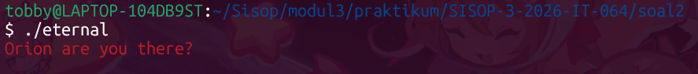  
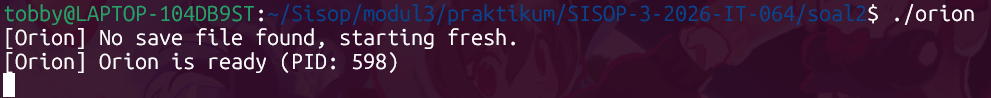  
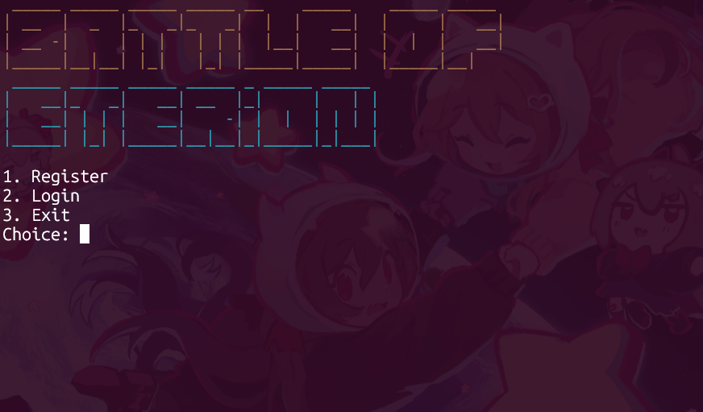  
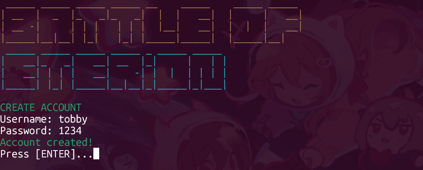  
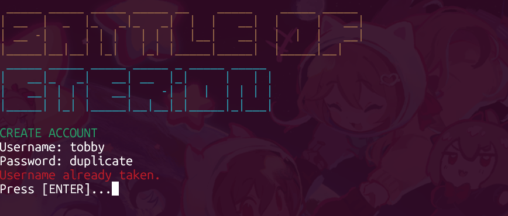  
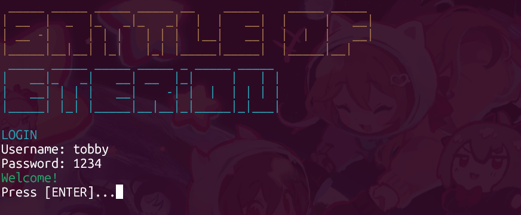  
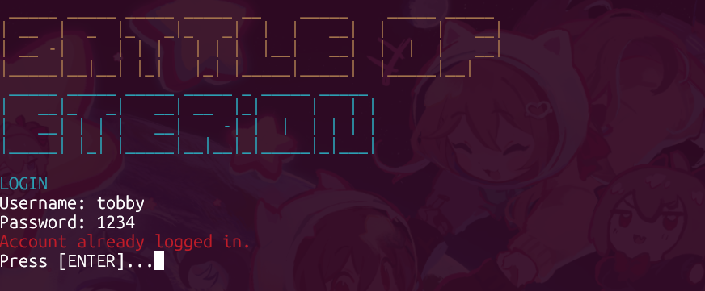  
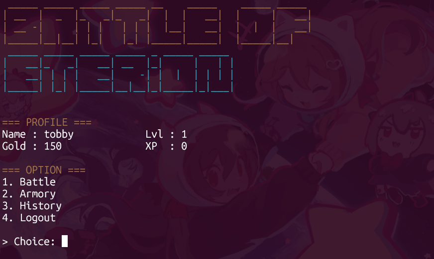  
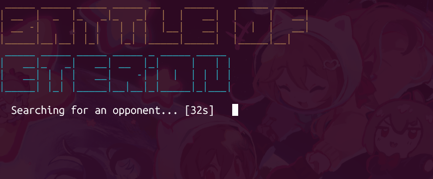  
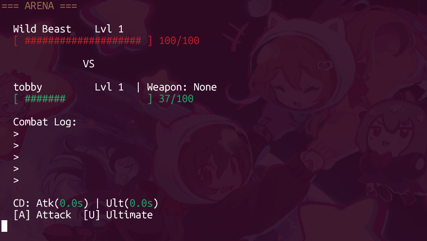  
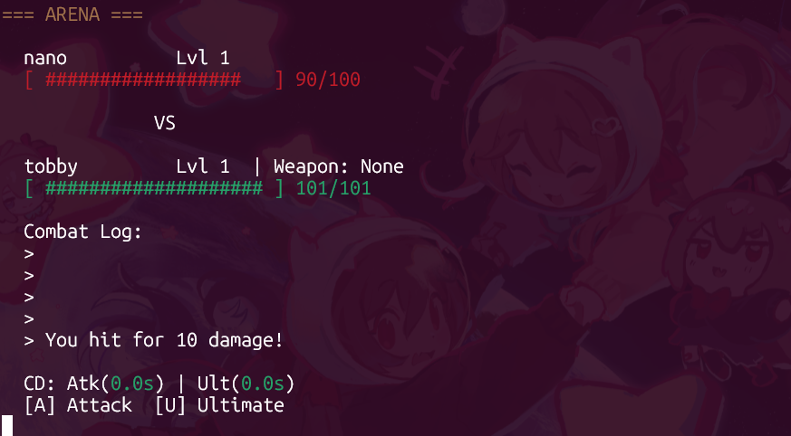  
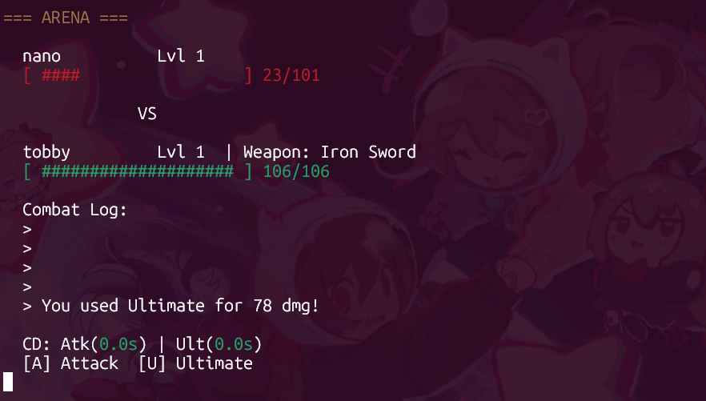  
  
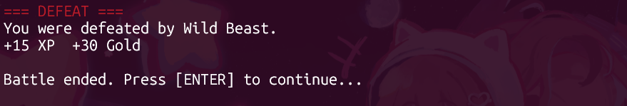  
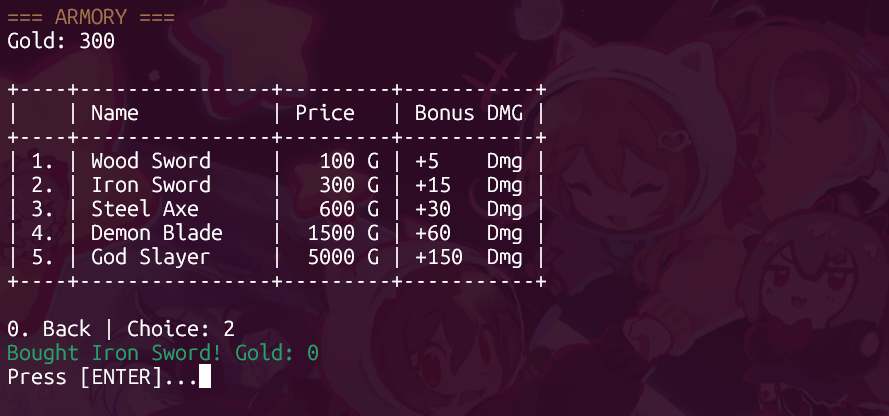  
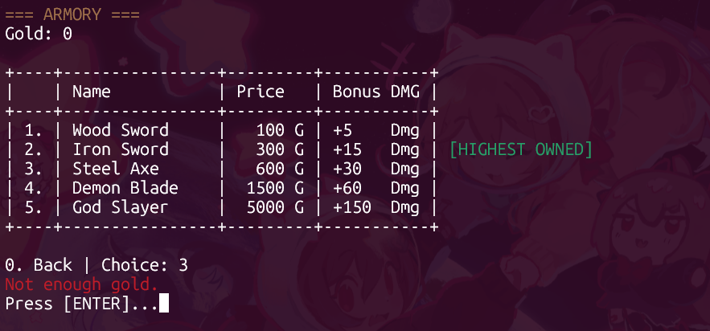  
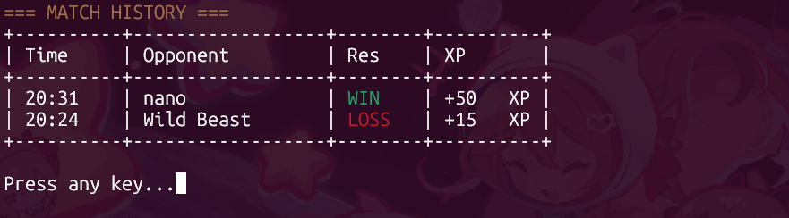  
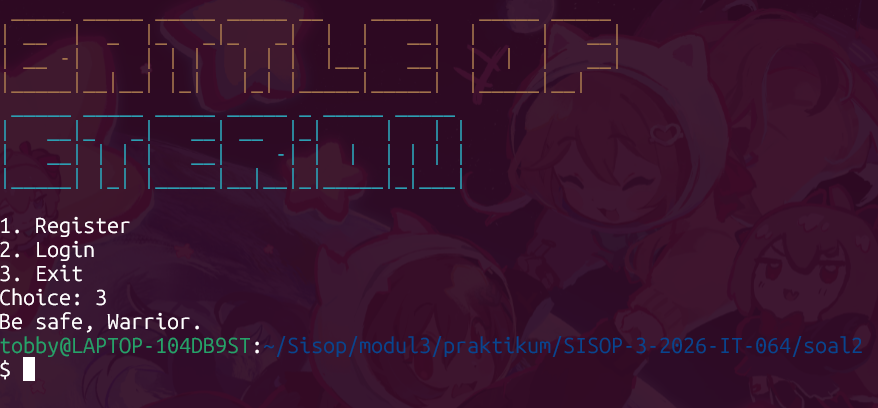  

Selanjutnya, kita harus jalankan server terlebih dahulu dengan ``./orion``.
